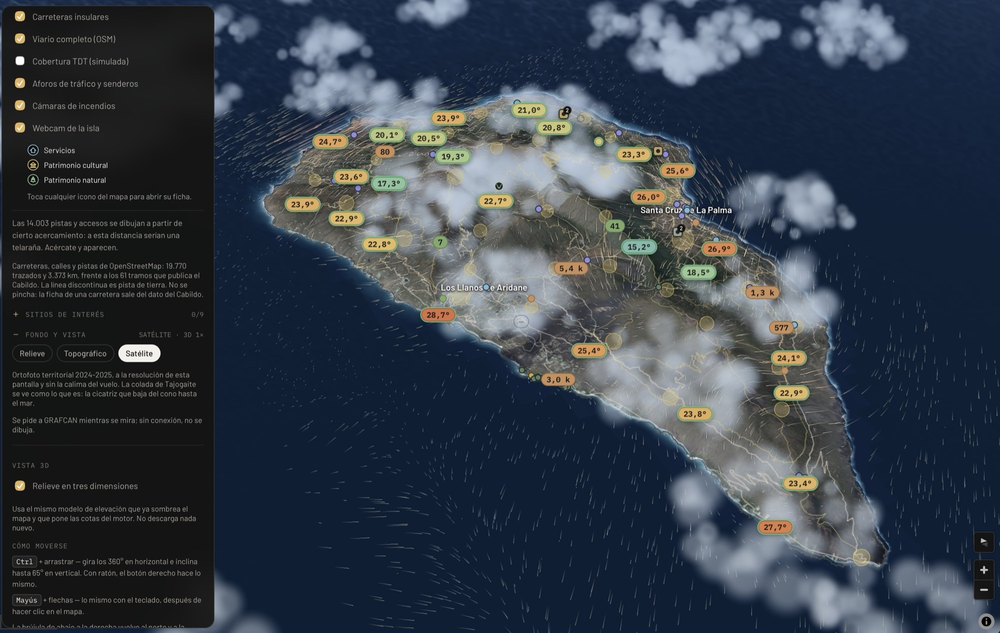
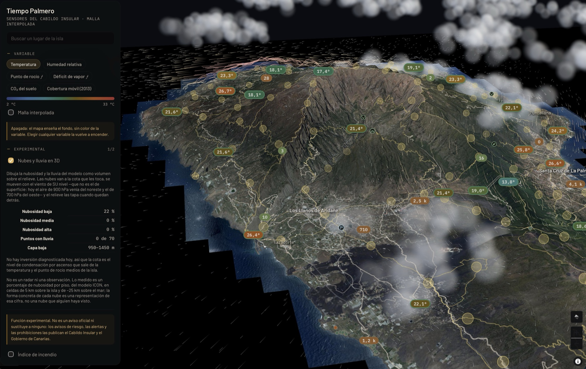

# Tiempo Palmero

[](https://github.com/andreapianidev/tiempo-palmero/actions/workflows/ci.yml)
[](https://app.tiempopalmero.com)
[](https://www.tiempopalmero.com)
[](https://github.com/andreapianidev/lapalma3d)
[](LICENSE)
[](https://www.opendatalapalma.es)
[](CONTRIBUTING.md)

**Meteorología interpolada a alta resolución para la isla de La Palma,
construida sobre los datos abiertos del Cabildo Insular.**

Tocas cualquier punto del mapa y obtienes una estimación del tiempo **en ese
punto**, no la lectura de la estación más cercana. Es una distinción que en La
Palma no es un matiz: la isla sube de 0 a 2426 m en 42 km, y a esa escala la
altitud manda sobre la distancia en cualquier variable atmosférica.

**Probar la aplicación → [app.tiempopalmero.com](https://app.tiempopalmero.com)**
— en marcha, sin registro, sin clave de API y sin nada que instalar. Se ve igual
en un teléfono: por debajo de 720 px de ancho la interfaz cambia a su propia
carcasa, con una hoja que sube desde abajo en vez del panel lateral.

Y **quien quiera, la instala**: «Añadir a pantalla de inicio» en iOS, «Instalar
aplicación» en Android y en el escritorio, y a partir de ahí abre con su icono,
sin barra de direcciones y **sin cobertura** —el mapa, el relieve y los
topónimos quedan guardados; los datos de las estaciones, no, porque un dato del
Cabildo de hace dos horas servido como si fuera de ahora sería mentir—. Ni
tiendas ni envoltorio nativo: es la misma web. Cómo está montado, en
[Arquitectura](docs/arquitectura.md#se-instala-y-en-las-tres-tiendas-de-nadie).

Y hay una **rama en tres dimensiones**:
**[andreapianidev/lapalma3d](https://github.com/andreapianidev/lapalma3d)**
reconstruye la isla entera a escala real —el MDT de 5 m del IGN, la ortofoto de
31 cm de GRAFCAN y los puntos del Cabildo, 41 × 51 km en ochenta terrenos, un
metro de Unity por metro de isla— y se navega como en Google Earth. Comparte con
esta el modelo del terreno y la red de estaciones: aquella contesta *cómo es
este punto*, esta *qué tiempo hace en él*. Hoy se compila en **macOS con Apple
Silicon** sobre Unity 6 y HDRP; el resto de plataformas vendrá después. El
puente meteorológico entre las dos está escrito y cableado, **todavía no
ejecutado con datos reales**, y así se cuenta en los dos sitios.

Y **[tiempopalmero.com](https://www.tiempopalmero.com)** es el sitio que la
cuenta: para quién es, qué hace, quién cruza cada sendero, qué se ve del cielo,
de qué datos sale todo y con qué licencia. Su código está en [`web/`](web/) —
estático, sin dependencias, sin analítica y sin una sola petición a un tercero:
las dos tipografías de la aplicación van servidas desde `web/fonts/`, y la CSP
del sitio es `default-src 'none'` con todo lo demás en `'self'`.

La página se lee como una subida de la costa al Roque, y **la isla está
levantada en tres dimensiones a un lado**: una malla de 209×333 cotas que gira
con el desplazamiento mientras la cámara baja hacia la cumbre y el sol cruza el
cielo hasta ponerse. Sale del mismo modelo de elevación con el que la aplicación
corrige la temperatura —`npm run web:terreno` escribe la malla,
`web/js/isla3d.js` la dibuja con WebGL a pelo, sin biblioteca— y va coloreada
con la escala de temperatura de la aplicación.

Y **mientras gira le cambia el tiempo**: pasa por cuatro regímenes reales de La
Palma, cada uno con su día y su campo de temperatura medido, y el relieve se
repinta con el que toque. La gracia es que los cuatro no se parecen en nada,
midiéndolos con el mismo motor de la aplicación sobre la red del Cabildo:

| Régimen | Día medido | Gradiente de una recta | R² | Lo que pinta el relieve |
|---|---|---|---|---|
| Alisio | 6 nov 2025 | 8,0 °C/km | 0,89 | esa recta — mar de nubes contra el nordeste, seco encima |
| Temporal del suroeste | 21 mar 2026 | 7,9 °C/km | 0,96 | esa recta — isla dentro de la nube, lluvia torcida del OSO |
| Noche despejada | 7 dic 2025 | 6,0 °C/km | 0,60 | dos capas (R² 0,77): −4,9 °C al cruzar los 750 m |
| Calima | 8 ago 2026 | **−2,4 °C/km** | 0,11 | dos capas (R² 0,25): +3,6 °C al cruzar los 650 m |

La columna del R² es la de **una sola recta**, para que los cuatro se comparen con
la misma vara. Donde una recta no da —la calima y la noche— el relieve se pinta
con dos capas, y es ese segundo R² el que sale en la etiqueta de la pantalla.

El gradiente altitudinal no es una constante de la isla: es la huella del
régimen. Con temporal una sola recta explica la isla entera; con calima la
temperatura sube con la altura y ninguna recta explica nada. Las cifras las mide
`scripts/checks/regimenes.ts` contra el archivo público del Cabildo, y están
comentadas una a una en `web/js/isla3d/regimenes.js`. No son el tiempo de ahora
y la página no lo insinúa: cada régimen lleva su fecha escrita al lado.

Si no hay WebGL, si la tarjeta no da para ello o si el sistema pide no animar,
queda un plano de curvas de nivel de la misma isla y del mismo modelo
(`npm run web:island`). Y todo —el cielo, el raíl de la izquierda, la cámara—
cuelga de una sola variable CSS que el desplazamiento va reescribiendo.

El raíl **ya no es un altímetro**. Decía la cota y nada más, y la cota sola
cuenta el argumento equivocado: esta isla no interesa por lo alta que es, sino
por lo que se mide en cada una de sus franjas y por quién anda en ellas. Ahora
cada hito lleva la cota, el sitio y qué se cuenta ahí —de «0 m · el puerto · el
mar y el oleaje» a «2426 m · el Roque · 8920 estrellas»— y esos siete hitos son
las siete secciones de la página, en orden.

Los límites de los cuatro regímenes están **pegados a dónde cae cada sección**
en esa variable, así que **añadir o quitar una sección los descalibra**: `--asc`
es una fracción de la página entera, y alargarla empuja todo lo de abajo hacia
arriba. Lo mide `scripts/checks/portada-secciones.ts`, que dice en qué `--asc`
queda centrada cada sección, comprueba contra el propio `regimenes.js` que a
cada una le toca el régimen que le toca, y escupe los `LIMITES` y las `PARADAS`
que tocan si no. Lo mismo vale para el punto por el que se cruza el mar de
nubes, que tiene que caer por un hueco destapado —`--panel` es opaco al 92 % y
detrás de él no se ve pasar nada.

```bash
python3 scripts/checks/servir.py 4173 web &
npx tsx scripts/checks/portada-secciones.ts  http://127.0.0.1:4173/index.html
npx tsx scripts/checks/portada-regimenes.ts  http://127.0.0.1:4173/index.html
```

Ese `servir.py` no es un capricho: `python3 -m http.server` habla HTTP/1.0 y bajo
la ráfaga de la portada —trece hojas, cuatro guiones, dos tipografías y el
terreno— suelta conexiones. Las que se caen son siempre las últimas de la lista,
así que la página sale a medio vestir y parece un fallo del CSS. Con HTTP/1.1 y
la cola de peticiones más larga, no.

El segundo es el que de verdad manda: fotografía la página en cada parada, con
las letras y sin ellas, y mide el contraste de **cada texto contra los píxeles
que de verdad tiene debajo** — no contra el color declarado en el CSS. Son 475
medidas, y encontró dos avisos por debajo del mínimo la última vez que se tocó
esto.



La isla entera, con el tiempo que hacía en ese momento. Cada pastilla es un
punto de la red del Cabildo con su lectura; las nubes y las cortinas de lluvia
están dibujadas **en volumen sobre el relieve**, a la cota que les toca. En el
panel de la izquierda se encienden y se apagan las capas: las carreteras del
Cabildo, el viario completo de OpenStreetMap, los aforos de tráfico y de
senderos, las cámaras de incendios y las webcam de la isla.

---

## Índice

**En esta página**, que se lee entera en diez minutos:

- [Las funciones, en dos minutos](#las-funciones-en-dos-minutos) — qué se ve en
  pantalla y para qué sirve cada cosa, sin entrar en el motor
- [Por qué existe](#por-qué-existe) — el problema que resuelve, en números
- [Qué hace](#qué-hace)
- [Honestidad de los datos](#honestidad-de-los-datos) — las reglas que no se
  saltan, y [la capa de CO₂](#la-capa-de-co₂), que es la más estricta de todas
- [Licencias en tiempo de ejecución](#licencias-en-tiempo-de-ejecución) — qué se
  llama de verdad, y con qué permiso
- [Puesta en marcha](#puesta-en-marcha) · [Fuentes y licencias](#fuentes-y-licencias)
  · [La licencia del código](#la-licencia-del-código-libre-con-atribución)

**En los cuatro documentos largos** — la tabla completa está
[más abajo](#la-documentación-larga):

- [**El motor de interpolación**](docs/motor.md) — los seis pasos y las
  decisiones que los sostienen ·
  [Validación](docs/motor.md#validación) ·
  [La banda de incertidumbre](docs/motor.md#la-banda-de-incertidumbre-está-calibrada-no-supuesta)
- [**Los datos del Cabildo**](docs/datos-del-cabildo.md) — hoja de ruta sobre los
  49 conjuntos del portal ·
  [La red de guaguas](docs/datos-del-cabildo.md#la-red-de-guaguas-y-los-sitios-que-ahora-se-pueden-encender) ·
  [Los aforos](docs/datos-del-cabildo.md#los-aforos-y-el-endpoint-que-no-dice-lo-que-parece), el
  endpoint que se llama «hoy» y publica cinco minutos ·
  [Las webcam](docs/datos-del-cabildo.md#las-webcam-y-el-dataset-que-apunta-a-un-servidor-caído),
  29 de 60 URL vivos ·
  [El mapa de viento](docs/datos-del-cabildo.md#el-mapa-de-viento) ·
  [El histórico](docs/datos-del-cabildo.md#el-histórico-y-por-qué-no-hay-base-de-datos),
  sin base de datos propia
- [**La sección experimental**](docs/experimental.md) —
  [la escena atmosférica](docs/experimental.md#la-escena-atmosférica-nubes-y-lluvia-en-volumen):
  cuántas nubes dibuja y por qué esa cuenta sale de una fórmula y no de un gusto ·
  [la luz del sol](docs/experimental.md#la-luz-del-sol-sobre-el-relieve) ·
  [el cielo estrellado](docs/experimental.md#el-cielo-estrellado-8920-estrellas-y-un-fotómetro-que-decide-cuántas-se-ven) ·
  [la luna](docs/experimental.md#y-la-luna-que-es-lo-primero-que-se-mira): por qué hubo
  que cambiarla entera antes de poder dibujarla ·
  [los planetas](docs/experimental.md#y-los-planetas-y-una-tabla-que-sobraba): una
  tabla de 36 KB que pesaba más que la biblioteca que evitaba ·
  [la Vía Láctea](docs/experimental.md#y-la-vía-láctea-que-no-es-una-fotografía):
  no es una foto, y cuánto se ve lo deciden los fotómetros ·
  [el índice de incendio](docs/experimental.md#el-índice-de-incendio): seis
  incendios, un clasificador validado escondiendo uno entero cada vez
- [**Arquitectura**](docs/arquitectura.md) —
  [la vista 3D](docs/arquitectura.md#la-vista-3d), con su propia fuente de relieve ·
  [el océano](docs/arquitectura.md#el-océano), dos trenes de olas sobre
  batimetría real ·
  [lo elegido dura](docs/arquitectura.md#lo-elegido-dura) ·
  [las teselas que se quedan](docs/arquitectura.md#las-teselas-que-se-quedan),
  la cartografía de GRAFCAN guardada en el navegador ·
  [las trampas de esta API](docs/arquitectura.md#trampas-de-esta-api-que-ya-están-resueltas-en-el-código),
  un día de depuración cada una ·
  [se instala](docs/arquitectura.md#se-instala-y-en-las-tres-tiendas-de-nadie),
  y [el icono es la isla medida](docs/arquitectura.md#el-icono-es-la-isla-medida)

---

## Las funciones, en dos minutos

Lo que sigue es la aplicación contada por lo que hace, no por cómo lo hace. El
detalle técnico de cada cosa está en [su documento](#la-documentación-larga);
aquí solo está para qué sirve y qué hay que creerse de lo que se ve.

### El mapa entero, no las chinchetas

La isla se pinta como una **malla continua de color**: el valor de la variable
elegida en cada punto, no un puñado de marcas donde hay sensor. Se elige entre
temperatura, humedad relativa, punto de rocío, déficit de presión de vapor, CO₂
del suelo y cobertura móvil, y la escala de color se ajusta a lo que hay ese
día. La malla se puede **apagar**: el mapa se queda con el fondo y las pastillas
de las estaciones, que es lo cómodo para mirar el relieve o la ortofoto sin
color encima.

Encima de la malla van las **pastillas**: cada estación de la red del Cabildo
con su lectura del momento. Verde y naranja no son decoración, son la escala de
la variable.

### La ficha de un punto

Se toca cualquier sitio del mapa —haya sensor o no— y sale la estimación para
ese punto concreto, con todo lo que hace falta para juzgarla.


En la captura, un punto cualquiera de El Paso a 509 m. La cifra grande es una
**estimación**, y la interfaz no lo disimula: lleva su margen al lado, el
municipio calculado por geometría, y las tres estaciones que sostienen el
cálculo con su distancia y su desnivel. La estación que más pesa está 251 m más
arriba y a 3,5 km; la segunda, 143 m más abajo. Sin corregir por altitud, esas
dos se promediarían como si estuvieran en el mismo sitio.

Debajo del margen, **cuándo se midió** lo que sostiene la cifra: «medido hace
19 min, la más antigua hace 38 min». Es un reloj distinto del de la descarga —
los datos pueden haberse pedido hace diez segundos y las lecturas ser de hace
hora y media, y es lo segundo lo que dice si el número sigue valiendo. La
antigüedad se pondera con el mismo peso que el valor: si el 80 % de la cifra
sale de una estación, la frescura que se anuncia es la de esa estación.

Abajo a la izquierda, el estado del modelo: **35 de 52 estaciones activas** —el
denominador real, no el del catálogo—, el gradiente medido en ese instante
(4,06 °C/km, no los 6,5 del manual), el R² del ajuste y el RMSE de validación.

### Las capas que se encienden

Todo lo demás que publica el Cabildo, en interruptores:

- **Carreteras insulares** y **viario completo de OpenStreetMap** — 19.770
  trazados y 3.373 km frente a los 61 tramos del catálogo del Cabildo. Las
  14.003 pistas y accesos aparecen al acercarse, porque a vista de isla serían
  una telaraña. La línea discontinua es pista de tierra.
- **Aforos de tráfico y de senderos** — los contadores de la isla con su cifra
  del día.
- **Cámaras de incendios** y **webcam de la isla**, con enlace a la imagen viva.
- **Cobertura de TDT**, que es una simulación de propagación de 2018, no una
  medida — y va dicho donde se enciende.
- **Sitios de interés**: servicios, patrimonio cultural y patrimonio natural.
  Se toca el icono y sale su ficha.
- **La red de guaguas** de TILP, con el horario y la fecha del archivo delante.

### El fondo y la vista en tres dimensiones

Tres fondos: **relieve** sombreado, **topográfico** y **satélite** —la ortofoto
territorial 2024-2025 de GRAFCAN, pedida a la resolución de la pantalla, en la
que la colada de Tajogaite se ve como lo que es, y que es **el fondo de la
primera visita**—. Y un interruptor de **relieve en tres dimensiones** que usa
el mismo modelo de elevación que ya sombrea el mapa, pero con **fuente propia**:
compartirla dejaba el sombreado borroso, y separarlas cuesta un 18 % más de
teselas del DEM local —87 a 103, medido— a cambio de un 49 % más de detalle. Con
`Ctrl` y arrastrando se gira 360° y se inclina hasta 65°, o hasta 75° con el
fondo de relieve.

### Lo experimental: seis funciones que dibujan más de lo que miden

Hay una sección aparte, plegada y detrás de un aviso, para las funciones que
**no se sostienen igual que el resto**. Están separadas a propósito: ponerlas
junto a la temperatura las igualaría con una medida, y no lo son. Ninguna es un
aviso oficial ni sustituye a ninguno — las alertas y las prohibiciones las
publican el Cabildo Insular y el Gobierno de Canarias.



En el panel de la captura, la escena atmosférica declarando exactamente lo que
sabe: 22 % de nubosidad baja, 0 % media y alta, ningún punto con lluvia de los
70 que mira, y la capa baja entre 950 y 1450 m. Debajo, en letra pequeña, lo
que no sabe: que la forma concreta de cada nube es una representación de esa
cifra, no una nube que alguien haya visto.

**Nubes y lluvia en 3D.** Dibuja el tiempo del momento como volumen sobre el
relieve: bancos de nubes a su cota, moviéndose con el viento de *su* nivel —que
no es el de superficie—, y cortinas de lluvia colgando hasta el suelo de las que
llueven. El dato es el porcentaje de nubosidad por piso y los milímetros de la
última hora; el dibujo es la silueta. No es un radar ni una observación.

**La luz del sol sobre la isla.** Lo último que ha entrado, y lo que más cambia
la pantalla. Hasta ahora el relieve se iluminaba desde el noroeste fijo —la
convención de los mapas de toda la vida— mientras el mar reflejaba el sol en su
sitio real y las nubes se encendían por donde les daba: tres soles distintos a
la vez. Ahora la isla se ilumina **desde donde está el sol**, y con ello vienen
cuatro cosas que se encienden por separado:

- **Luz del sol real** — el relieve sigue al sol de verdad, y de noche a la
  luna, con su fase.
- **Sombras arrojadas** — la pared de la Caldera le quita el sol al barranco de
  al lado, que es media escena de cualquier atardecer. Y las nubes proyectan su
  sombra en el suelo que tienen debajo.
- **El disco del sol** — dónde está ahora mismo, con su altura y su azimut.
- **La carrera del sol** — el camino que recorre hoy, con una marca por cada
  hora en punto, para ver a qué hora le entra el sol a un sitio y a qué hora se
  lo quita la cumbre.

**El índice de incendio.** Una estimación del peligro a partir del tiempo que
hace y del modelo de combustible, calibrada contra el clima de 2001-2024 y
validada escondiendo cada incendio real entero, uno por uno. Dice lo que puede
decir y lo que no, y no es una alerta.

**El viento animado.** Partículas siguiendo un campo continuo que no existe en
ningún sensor: se construye mezclando las estaciones que publican dirección con
una rejilla de modelo donde no llega ninguna. En una isla donde dos puntos a
5 km pueden soplar al revés, ese relleno es buena parte de lo que se ve. La
cifra honesta —cuánto es medido y cuánto modelado— sigue en la sección «Viento».

**El mar en movimiento.** La altura de ola, el periodo, la marea y la
profundidad son dato; la ola que se ve romper en un punto la pone un sombreador.
Por eso está aquí y no en «Océano», que es donde viven las cartas ajenas y
publicadas — el balizamiento de OpenSeaMap y la batimetría de EMODnet.

---

## Por qué existe

La red del Cabildo tiene 52 estaciones meteorológicas registradas. La respuesta
ingenua a «¿qué tiempo hace en El Pinar de Tijarafe?» es buscar la estación más
próxima y enseñar su número. En esta isla eso se equivoca por unos 2,5 °C, y
puede equivocarse mucho más: la estación más cercana a El Pinar está 321 m más
abajo, y una estación 321 m más abajo lee unos 2 °C de más.

La respuesta correcta es separar lo que explica la altitud de lo que es
variación local, interpolar solo la segunda parte y devolver la primera a la
altitud real del punto de destino. Bien hecho, el error baja a ~1,2 °C.

Y hay un detalle que resulta pesar más que todo el resto junto: **un solo sensor
descalibrado envenena el mapa entero.** Hay uno a 1561 m que en agosto marcaba
9,7 °C. Pasa el filtro de plausibilidad —a esa altitud no es un valor absurdo—
pero arrastra la pendiente del ajuste y con ella la estimación de toda la isla.
Detectarlo y descartarlo mejora el RMSE un **43,7 %**.

---

## Qué hace

- **Malla interpolada** de temperatura, humedad relativa, punto de rocío y
  déficit de vapor, recalculada sobre el retículo del modelo de elevación con
  celda de ~200 m. Se enciende junto a los chips de variable, y no en la lista
  de capas: lo que pinta es justo la variable que se acaba de elegir.
- **Mancha de CO₂** de la zona vigilada del oeste, con celda de 15 m —la escala
  a la que está puesta la red DEMASE— y sin promediar entre sensores.
- **Consulta punto a punto**: altitud del DEM, municipio calculado
  geométricamente, valor estimado **con su margen**, y las tres estaciones que
  más han contribuido, con su distancia y su desnivel.
- **Estaciones meteorológicas** con color por frescura del dato y todos sus
  valores en crudo.
- **Sensores de CO₂** de Puerto Naos y La Bombilla, con reglas de seguridad
  estrictas (ver abajo).
- Calidad del aire, calidad del cielo, cámaras de incendios, senderos y sus
  1190 puntos de interés.
- **Red de guaguas de TILP**: 23 líneas, 58 trazados y 913 paradas, con la ficha
  de cada parada —líneas, servicio, accesibilidad y las horas de paso de la
  última tabla publicada— y el recorrido de cada línea resaltado en el mapa (ver
  [la red de guaguas](docs/datos-del-cabildo.md#la-red-de-guaguas-y-los-sitios-que-ahora-se-pueden-encender)).
- **Sitios del Cabildo, uno a uno**: interés turístico, **miradores**, interés
  cultural e histórico, zonas recreativas y puntos de recarga eléctrica, cada
  capa con su interruptor y su icono, y la **red de carreteras** debajo de todo,
  que también se pincha para ver de dónde a dónde va cada tramo.
- **Viario completo de OpenStreetMap**: 19.770 trazados y 3.373 km, de los que
  2.225 km son pistas agrícolas y forestales y caminos de servicio. Es lo que
  las 61 carreteras del Cabildo no pueden ser —un callejero— y va por debajo de
  todas ellas (ver [el viario](docs/datos-del-cabildo.md#el-viario-que-el-cabildo-no-publica)).
- **Cobertura de TDT simulada**: las 49 simulaciones de propagación de los
  repetidores que el Cabildo publica en un KMZ, fundidas en un mapa de celdas de
  92 m. Cubren el 51,6 % de la isla, y la ficha de un punto dice cuántos
  repetidores lo alcanzan (ver
  [la cobertura de TDT](docs/datos-del-cabildo.md#la-cobertura-de-tdt-que-estaba-en-un-kmz)).
- **Aforos de tráfico y de senderos**: cuánta gente pasa hoy por cada cruce y
  por cada acceso a sendero, separando coches, motos, pesados, bicicletas y
  peatones, con los últimos ocho días en barras y el denominador de la red a la
  vista (ver [los aforos](docs/datos-del-cabildo.md#los-aforos-y-el-endpoint-que-no-dice-lo-que-parece)).
- **Webcam de la isla**: 18 emplazamientos y 26 ángulos, de las 60 que publica
  el Cabildo, en una sola capa. Al pinchar una salen sus imágenes, de cuándo es
  cada una y quién la opera (ver
  [las webcam](docs/datos-del-cabildo.md#las-webcam-y-el-dataset-que-apunta-a-un-servidor-caído)).
- **Nubes y lluvia en tres dimensiones** (experimental): la nubosidad de los
  tres pisos y la precipitación del modelo, dibujadas como volumen sobre el
  relieve, cada capa a su cota y arrastrada por el viento de SU nivel —que no es
  el de superficie— (ver [la escena
  atmosférica](docs/experimental.md#la-escena-atmosférica-nubes-y-lluvia-en-volumen)).
- **Relieve sombreado** del mismo modelo de elevación que alimenta el cálculo,
  recortado por la línea de costa que publica el Cabildo (ver [cómo se dibuja el
  relieve](docs/arquitectura.md#el-relieve-lo-dibuja-el-hillshade-de-maplibre-y-no-un-shader-propio)).
  La isla es un volcán: la sombra es lo que la hace legible.

Todo en castellano. La estructura de i18n está lista para más idiomas.

---

## Honestidad de los datos

Las reglas que la aplicación no se salta:

- **El denominador es el real.** Se lee «36 de 52 estaciones activas», nunca
  «52 estaciones». La diferencia son estaciones muertas, rotas o con las
  coordenadas en mitad del Atlántico.
- **Un valor interpolado no es una medida** y la interfaz lo dice, con su
  margen al lado.
- **La precipitación no se interpola.** La vertiente noreste recibe múltiplos de
  la suroeste a igual altitud. Se muestra la estación más cercana, declarada
  como tal, con su distancia y su desnivel.
- **El viento no se interpola entre estaciones: se rellena con un modelo.** La
  regla anterior decía «el viento tampoco se interpola» y se ha cambiado a
  conciencia, no relajado. Sigue prohibido estirar la estación más cercana:
  cada una manda solo en unos 3 km a su alrededor, que es lo que dura su
  representatividad antes de que un barranco o la divisoria cambien el régimen.
  Lo que ocupa el hueco no es una media de las lejanas, sino Open-Meteo, que sí
  resuelve la orografía; y cada celda lleva escrito cuál de los dos la sostiene.
  Ver «El mapa de viento» más abajo.
- **La calidad del aire no se interpola nunca.** Veinte estaciones repartidas
  por la isla son medidas puntuales; dibujar una superficie entre ellas sería
  inventar lecturas donde no hay sensor.
- **El CO₂ se colorea, pero no se promedia.** Es la única excepción a la regla
  anterior, y sale de la densidad de la red, no de un cambio de criterio: los
  209 sensores DEMASE de Puerto Naos y La Bombilla están a una separación
  *mediana de 15 m* (medido el 13 ago 2026), así que cada punto de la zona
  vigilada tiene una medida real casi encima. El mapa enseña la lectura del
  sensor **más cercano** y se corta a 80 m; no hay IDW, no hay media, no hay
  corrección altimétrica. Dos motivos, y el segundo es el que manda: entre dos
  sensores separados 20 m se han medido 400 y 69 301 ppm el mismo minuto —una
  media dibujaría una pluma que no existe—, y promediar un dato de seguridad lo
  baja. Fuera de esa zona la isla se queda **sin color**: no hay ni un sensor
  de CO₂ más (la red de calidad del aire del Cabildo trae la columna `co2`
  vacía en sus 20 estaciones) y lo único disponible es el fondo del modelo
  CAMS, 436–439 ppm iguales para toda la isla sobre una malla de 40 km, que es
  ruido de celda y no un campo. Ver `src/lib/co2/field.ts`.
- **Los valores implausibles se descartan, no se recortan.** Recortar un sensor
  que marca 70 °C a un máximo de 45 lo convertiría en un dato creíble. Vale
  igual para los valores *calculados*: CABLPA-BELLIDO publica 1 % de humedad a
  852 m —un higrómetro muerto— y de ahí salía un punto de rocío de −38,4 °C que
  se pintaba en el pin como cifra. Un valor derivado pasa el mismo filtro que
  uno medido.
- **Lo que viene de un modelo va etiquetado como modelo.** Por encima del techo
  de la red del Cabildo se usan anclas de Open-Meteo, y aparecen siempre con su
  nombre. Ver «El techo de la red» más abajo.
- **Un sensor se juzga por su serie, no por su última lectura.** Un número
  plausible dentro de una serie imposible sigue siendo falso, y hasta agosto de
  2026 se pintaba como cualquier otro. Ver «El diagnóstico temporal» más abajo.
- **Las estaciones que no llegan al mapa se dicen por su nombre.** El
  denominador honesto era ya mejor que presumir del total, pero dejaba sin
  contestar la pregunta siguiente. El bloque «Fuera del mapa» del panel lateral
  lista las que faltan y desde cuándo: el 13 de agosto de 2026 eran 17 de 52
  —14 sin transmitir hace más de dos horas, una de ellas parada desde mayo de
  2023, y 3 transmitiendo sin temperatura.

### La capa de CO₂

Los sensores de la red DEMASE miden hasta **69.301 ppm** — 6,9 %, letal en
minutos. Son el motivo por el que Puerto Naos fue evacuada. Esta pantalla está
escrita para fallar en cerrado:

- Solo se muestran valores medidos, con su hora explícita.
- **Si el dato tiene más de 15 minutos, se lee «sin datos».** Nunca un verde
  rancio, nunca la última lectura buena heredada.
- Si la red no responde, tampoco. No hay caché de respaldo en esta capa.
- No se interpola ni se colorea el área entre sensores.
- **No aparece la palabra «seguro»** en ningún sitio. Se da el valor y la hora;
  quien declara un lugar seguro es el Cabildo.
- No lleva publicidad ni muro de pago, y no los llevará.

---

## La documentación larga

Lo que sigue del proyecto no cabe aquí sin volver esta página ilegible, así que
está en cuatro documentos. Cada uno se lee solo.

| Documento | De qué va | Líneas |
|---|---|---:|
| **[El motor de interpolación](docs/motor.md)** | Los seis pasos, la corrección altimétrica, el rechazo de valores atípicos, la banda de incertidumbre calibrada y la validación dejando fuera cada estación por turno. | 448 |
| **[Los datos del Cabildo](docs/datos-del-cabildo.md)** | Los 49 conjuntos del portal, uno por uno: lo integrado, lo que falta, lo que no conviene añadir. Las guaguas, los aforos, las webcam, el viario, la cobertura de TDT. | 783 |
| **[La sección experimental](docs/experimental.md)** | Las seis funciones que dibujan más de lo que miden: el cielo estrellado con la luna y los planetas, nubes y lluvia en volumen, la luz del sol y sus sombras, el índice de incendio, el viento y el mar. | 1005 |
| **[Arquitectura](docs/arquitectura.md)** | El proxy, las teselas del DEM y sus tres usos, el relieve, la vista 3D, el océano, la caché de teselas de GRAFCAN, lo que dura entre visitas — y las trampas de esta API. | 726 |

---

## Se buscan colaboradores, sobre todo en la isla

Esto lo escribe una persona sola, y hay una clase de ayuda que vale más que
cualquier otra: **la de quien vive aquí**.

El motor se valida contra sí mismo, escondiendo cada estación por turno para ver
cuánto se equivoca al reconstruirla. Eso mide si el modelo es coherente con la
red. **No mide si acierta en tu barrio**, y para eso hace falta alguien que esté
ahí y mire por la ventana.

> Si vives en Garafía, en Puntagorda, en Barlovento, en Tijarafe o en cualquier
> sitio donde la red del Cabildo llega mal: abre la aplicación, toca tu pueblo y
> **cuenta en un issue en qué se equivoca**. «A las 8:30 en Las Tricias decía 19°
> y despejado, y había niebla cerrada.» Ese dato no está en ninguna API, y es lo
> que separa un modelo elegante de un modelo que sirve.

Valen igual los topónimos que el buscador no encuentra, las webcam que se
mudaron de URL, y saber dónde está físicamente un sensor — dos estaciones del
catálogo tienen coordenadas que caen **en el Atlántico**. Para nada de esto hace
falta saber programar.

Cómo empezar, las tres reglas que no se saltan y dónde escribir, en
**[CONTRIBUTING.md](CONTRIBUTING.md)**.

---

## Licencias en tiempo de ejecución

La procedencia de cada byte importa, así que aquí está escrita.

En tiempo de ejecución se llama a la API del Cabildo, a Open-Meteo y —solo si se
encienden— a los servicios de cartografía que alimentan un fondo o una carta.
Todo lo demás está **precalculado en tiempo de compilación** y servido como
fichero estático.

Este apartado decía «se llama a **dos** servicios» y ya no era cierto desde que
existen los fondos de GRAFCAN; queda corregido aquí en vez de dejar la
afirmación en pie. La lista completa de lo que se pide fuera, y cuándo:

| Servicio | Cuándo se pide | Licencia |
|---|---|---|
| API del Cabildo (`bi.lapalma.es`) | siempre | CC-BY |
| Open-Meteo *forecast* | siempre: anclas de cumbre y fondo del viento | CC-BY, API gratuita no comercial |
| Open-Meteo *marine* | con el océano encendido, una petición por refresco | ídem |
| GRAFCAN (IDECanarias) | con el fondo topográfico o la ortofoto — y la ortofoto es la de fábrica, así que también en la primera visita | libre y gratuita, sin descarga masiva |
| EMODnet Bathymetry (WMS) | con la carta náutica encendida | CC-BY 4.0 |
| OpenSeaMap | con la carta náutica encendida | ODbL 1.0 |

Las tres últimas **no tienen recorte de recuadro** en el caso de la carta
náutica, y es deliberado: el mar abierto es justamente su contenido. Los fondos
de GRAFCAN sí lo llevan, porque son cartografía de las islas y pedirles océano
sería pedir teselas vacías a un servicio cuya licencia prohíbe la descarga
masiva.

Y a GRAFCAN **se le pide cada tesela una vez**: desde agosto de 2026 las que ya
se han mirado se guardan 30 días en el navegador, porque el servicio no manda
ninguna cabecera de caché y sin eso el mismo trozo de isla se descarga entero
cada vez que vuelve a la pantalla. El balance con el servicio es a la baja —se
le piden 17 teselas de la isla de lejos al encender un fondo, y se le dejan de
pedir todas las que hoy se repiten—. Los números y el reparto están en
[las teselas que se quedan](docs/arquitectura.md#las-teselas-que-se-quedan).

- **Open-Meteo sí se llama en runtime**, en dos sitios: las anclas por encima
  del techo de la red y el fondo del mapa de viento. Este apartado llegó a
  afirmar lo contrario —«no se llama nunca»— y era falso desde que existen las
  anclas; queda corregido aquí en vez de dejar la afirmación en pie.

  **La aplicación es gratuita, y esa es una decisión tomada, no un estado
  provisional**: no cobra, no tendrá suscripción y no mostrará publicidad. Con
  eso encaja en el plan gratuito, cuyas condiciones dicen textualmente *«You may
  only use the free API services for non-commercial purposes»* y enumeran entre
  los usos **comerciales** *«operating websites or apps that have subscriptions
  or display advertisements»*.

  Queda escrito porque es **la condición que sostiene el mapa de viento y las
  anclas de cumbre**, y porque quien lea esto dentro de un año necesita saber
  que no es una pregunta abierta. Si alguna vez se cambiara de idea, ese mismo
  día habría que contratar el plan Standard (29 €/mes, endpoint
  `customer-api.open-meteo.com`) o quitar las dos llamadas — no vale enterarse
  después. Los **datos** son CC BY 4.0 y su uso comercial sí es libre; la
  restricción va sobre el **servicio** gratuito.

  La capa de CO₂ ya lo dice por su lado, y por un motivo más serio: **no lleva
  publicidad ni muro de pago, y no los llevará.** Es información de seguridad
  sobre gas volcánico.

  Cuota del plan gratuito, para dimensionar: 10.000 llamadas/día y 300.000/mes.
  El viento gasta **una** petición por refresco —los 54 puntos de la rejilla
  viajan en una sola URL— y las anclas otra.

  Atribución obligatoria junto a los datos:
  `<a href="https://open-meteo.com/">Weather data by Open-Meteo.com</a>`.

- **Nominatim y Overpass no se llaman nunca.** Su política de uso prohíbe el uso
  sistemático desde una aplicación. Los topónimos se extraen una sola vez con
  `scripts/prepare-data.ts` y se congelan en `public/gazetteer.json`, y el
  viario con `scripts/prepare-osm-roads.ts` en
  `public/layers/viario-osm.geojson`; los dos, con su atribución ODbL dentro del
  propio fichero.
- **Sin claves de API en el cliente.** El mapa base no usa Mapbox ni Google ni
  ningún proveedor de teselas de pago: el relieve se dibuja con el DEM local y
  los contornos que publica el propio Cabildo, y la ortofoto y el topográfico
  son cartografía pública de GRAFCAN, que tampoco pide clave.

---

## Puesta en marcha

```bash
npm install
npm run prepare-data     # descarga DEM, capas, topónimos y viario (una vez, ~2 min)
npm run dev
```

```bash
# Refrescar solo una parte, sin volver a bajarlo todo:
npm run prepare-data -- --only=viario     # viario de OSM (20 MB de Overpass)
npm run prepare-data -- --only=tdt        # cobertura TDT (KMZ del Cabildo)
npm run prepare-data -- --only=layers     # las capas del Cabildo
```

```bash
npm test                 # validación leave-one-out del motor
npm run build
```

```bash
# Lo que se dibuja desde el DEM y se versiona ya dibujado. Se vuelve a pasar
# cuando cambia el modelo de elevación, no antes:
npm run web:icons        # el icono de la aplicación y del sitio, 9 ficheros
npm run web:island       # las curvas de nivel de la portada
npm run web:terreno      # la malla 3D de la portada
```

Para refrescar solo una parte:

```bash
npm run prepare-data -- --only=dem        # dem | layers | gazetteer | snapshot
npm run prepare-data:snapshot             # nueva lectura congelada para los tests
```

```bash
# Comprobaciones que piden datos en vivo y se ejecutan a mano, no en CI:
npx tsx scripts/checks/grafcan-cache.ts   # qué cuesta hoy cada tesela de GRAFCAN
npx tsx scripts/checks/detalle-tiles.ts   # cuánto detalle da cada nivel de zoom

# Y la que necesita un navegador de verdad (Playwright, que no es dependencia):
npm i --no-save playwright && npx playwright install chromium
npm run dev &
npx tsx scripts/checks/tile-cache.ts      # que la caché no pida nada dos veces
```

El despliegue es un proyecto de Vercel sin variables de entorno: no hay ninguna
clave que configurar.

---

## Fuentes y licencias

- **Datos meteorológicos, aire, cielo, incendios y sensores** — Cabildo Insular
  de La Palma, Servicio de Transformación Digital (La Palma Smart Island).
  CC-BY 4.0. <https://www.opendatalapalma.es>
- **Límites municipales e insular** — Cabildo Insular de La Palma. ODC-BY.
- **Sitios, miradores y red de carreteras** — Cabildo Insular de La Palma.
  CC-BY 4.0. Los sitios y la recarga eléctrica salen del catálogo CKAN; los
  miradores y las carreteras, de los servicios ArcGIS del visor del Cabildo:
  <https://www.opendatalapalma.es/search?groupIds=c27000c1d7a84444bf4321b87e8d2223>
- **Cobertura de TDT** — Cabildo Insular de La Palma, `Simulaciones_Rep_TDT.kmz`
  (ArcGIS Online, 2018). CC-BY 4.0. Es una simulación de propagación de los 49
  sectores de repetidor, no una medida ni una garantía de recepción.
- **Aforos de tráfico y de senderos** — Cabildo Insular de La Palma, vertical
  `count` de la API (`count_locations`, `count_today`, `count_historic`).
  CC-BY 4.0.
- **Red de sensores de CO₂** — DEMASE, publicada a través del portal del
  Cabildo.
- **Transporte público** — GTFS de Transportes Insulares La Palma (TILP),
  publicado por el Cabildo. CC-BY 4.0. <https://www.tilp.es>
- **Topónimos y viario completo** — © colaboradores de OpenStreetMap, ODbL 1.0.
  Los dos se extraen en tiempo de compilación vía Overpass; la aplicación no
  consulta OpenStreetMap en tiempo de ejecución.
  <https://www.openstreetmap.org/copyright>
- **Modelo de elevación y relieve** — Mapzen Terrain Tiles vía AWS Open Data,
  derivadas de NASA SRTM, NASADEM, USGS 3DEP y EU-DEM.
- **Áreas quemadas** — Copernicus Emergency Management Service, EFFIS
  (incendios de 2016, 2020 y 2023). <https://forest-fire.emergency.copernicus.eu>
  Los perímetros de 2009 y 2012 son del Cabildo Insular de La Palma, CC-BY 4.0.
- **Modelos de combustible** — Gobierno de Canarias, Consejería de Medio
  Ambiente, cartografía de modelos de combustible, hoja de La Palma. El mapa de
  cultivos 2002–2008 que rellena la agricultura también es del Gobierno de
  Canarias, servido por el visor ArcGIS del Cabildo.
- **Archivo meteorológico** — Open-Meteo, archivo de reanálisis (ERA5), usado
  para los días sin llover y para el clima de 2001–2024 con el que se calibra la
  escala del peligro. Es un modelo, no una medida, y va etiquetado como tal.

### La licencia del código: libre, con atribución

El código es **[Apache License 2.0](LICENSE)**. Es software libre: se puede
usar, copiar, modificar, redistribuir y usar comercialmente, sin permiso previo
y sin pagar nada. La condición es **la atribución**, y por eso es Apache y no
MIT: la cláusula 4(d) obliga a quien redistribuya la obra —o una derivada— a
conservar el fichero **[NOTICE](NOTICE)**, que es donde están el autor y las
atribuciones de todos los datos de arriba. Con MIT el aviso también se conserva,
pero se pierde en la práctica en cuanto el código se empaqueta; el NOTICE de
Apache está pensado justo para que no ocurra.

En corto, para quien reutilice esto:

1. **Cita al autor** — Andrea Piani, <https://www.andreapiani.com> — y conserva
   el `NOTICE`.
2. **Mantén las atribuciones de los datos.** No son mías: son del Cabildo
   Insular de La Palma, de OpenStreetMap, del Gobierno de Canarias, de Copernicus
   y de los demás de la lista. La licencia del código no las cubre ni las
   sustituye.
3. Di qué has cambiado, si lo has cambiado. Lo pide la cláusula 4(b) y es de
   sentido común cuando lo que se toca son cifras que alguien va a leer.

---

## Autor

Proyecto de **Andrea Piani** — [www.andreapiani.com](https://www.andreapiani.com).
Software libre bajo **Apache 2.0 con atribución**: se puede usar, copiar y
modificar citando al autor y manteniendo las atribuciones de los datos. Ver
[LICENSE](LICENSE) y [NOTICE](NOTICE).

Escrito en El Paso, en la isla de La Palma, sobre los datos abiertos de su
Cabildo.

Aplicación en marcha: **[app.tiempopalmero.com](https://app.tiempopalmero.com)**
· Sitio: **[tiempopalmero.com](https://www.tiempopalmero.com)**
· Código: **[github.com/andreapianidev/tiempo-palmero](https://github.com/andreapianidev/tiempo-palmero)**

© 2026 Tiempo Palmero · Andrea Piani · Tijarafe, Santa Cruz de
Tenerife · Islas Canarias
