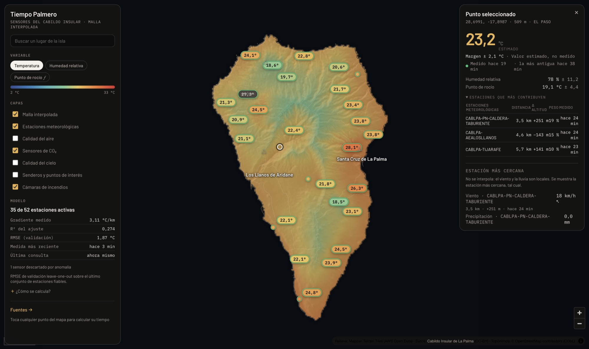

# Tiempo Palmero

**Meteorología interpolada a alta resolución para la isla de La Palma, a partir
exclusivamente de los datos abiertos del Cabildo Insular.**

Tocas cualquier punto del mapa y obtienes una estimación del tiempo **en ese
punto**, no la lectura de la estación más cercana. Es una distinción que en La
Palma no es un matiz: la isla sube de 0 a 2426 m en 42 km, y a esa escala la
altitud manda sobre la distancia en cualquier variable atmosférica.

**Probar la aplicación → [tiempo-palmero.vercel.app](https://tiempo-palmero.vercel.app)**
— en marcha, sin registro, sin clave de API y sin nada que instalar.

Hecho por **Andrea Piani** — [www.andreapiani.com](https://www.andreapiani.com)



En la captura, un punto cualquiera de El Paso a 509 m. La cifra grande es una
**estimación**, y la interfaz no lo disimula: lleva su margen al lado, el
municipio calculado por geometría, y las tres estaciones que sostienen el
cálculo con su distancia y su desnivel. La estación que más pesa está 251 m más
arriba y a 3,5 km; la segunda, 143 m más abajo. Sin corregir por altitud, esas
dos se promediarían como si estuvieran en el mismo sitio.

Debajo del margen, **cuándo se midió** lo que sostiene la cifra: «medido hace
19 min, la más antigua hace 38 min». Es un reloj distinto del de la descarga —
los datos pueden haberse pedido hace diez segundos y las lecturas ser de hace
hora y media, y es lo segundo lo que dice si el número sigue valiendo. La
antigüedad se pondera con el mismo peso que el valor: si el 80 % de la cifra
sale de una estación, la frescura que se anuncia es la de esa estación.

Abajo a la izquierda, el estado del modelo: **35 de 52 estaciones activas** —el
denominador real, no el del catálogo—, el gradiente medido en ese instante
(4,06 °C/km, no los 6,5 del manual), el R² del ajuste y el RMSE de validación.

---

## Índice

- [Por qué existe](#por-qué-existe) — el problema que resuelve, en números
- [Qué hace](#qué-hace)
- [Honestidad de los datos](#honestidad-de-los-datos) — las reglas que no se
  saltan, y [la capa de CO₂](#la-capa-de-co₂), que es la más estricta de todas
- [El motor de interpolación](#el-motor-de-interpolación) — los seis pasos y las
  decisiones que los sostienen · [Validación](#validación)
- [Qué más publica el Cabildo](#qué-más-publica-el-cabildo-y-qué-falta-por-aprovechar)
  — hoja de ruta sobre los 49 conjuntos del portal
- [La red de guaguas](#la-red-de-guaguas-y-los-sitios-que-ahora-se-pueden-encender)
  — la red en presente, el horario con su fecha delante ·
  [Los aforos](#los-aforos-y-el-endpoint-que-no-dice-lo-que-parece) — el
  endpoint que se llama «hoy» y publica cinco minutos ·
  [Las webcam](#las-webcam-y-el-dataset-que-apunta-a-un-servidor-caído) — 29 de
  60 URL vivos, y dónde se mudaron las del Cabildo
- [El mapa de viento](#el-mapa-de-viento) — la única capa donde un modelo pinta
  sobre la isla, y cómo se declara ·
  [El histórico](#el-histórico-y-por-qué-no-hay-base-de-datos) — 2 MB por día en
  origen, 124 KB en el navegador, cero almacenamiento propio ·
  [La vista 3D](#la-vista-3d) — sin una descarga más, y por qué no exagera el
  relieve · [El océano](#el-océano) — dos trenes de olas sobre batimetría real
- [La sección experimental](#la-sección-experimental) — [la escena
  atmosférica](#la-escena-atmosférica-nubes-y-lluvia-en-volumen): cuántas nubes
  dibuja y por qué esa cuenta sale de una fórmula y no de un gusto · [el índice
  de incendio](#el-índice-de-incendio): cinco incendios, un clasificador
  validado escondiendo uno entero cada vez, y todo lo que no puede hacer
- [Licencias en tiempo de ejecución](#licencias-en-tiempo-de-ejecución) — qué se
  llama de verdad, y con qué permiso
- [Arquitectura](#arquitectura)
- [La aplicación de iOS y Android](#la-aplicación-de-ios-y-android) — Expo sobre
  el mismo motor, sin una línea de cálculo duplicada
- [Trampas de esta API](#trampas-de-esta-api-que-ya-están-resueltas-en-el-código)
  — un día de depuración cada una
- [Puesta en marcha](#puesta-en-marcha) · [Fuentes y licencias](#fuentes-y-licencias)

---

## Por qué existe

La red del Cabildo tiene 52 estaciones meteorológicas registradas. La respuesta
ingenua a «¿qué tiempo hace en El Pinar de Tijarafe?» es buscar la estación más
próxima y enseñar su número. En esta isla eso se equivoca por unos 2,5 °C, y
puede equivocarse mucho más: la estación más cercana a El Pinar está 321 m más
abajo, y una estación 321 m más abajo lee unos 2 °C de más.

La respuesta correcta es separar lo que explica la altitud de lo que es
variación local, interpolar solo la segunda parte y devolver la primera a la
altitud real del punto de destino. Bien hecho, el error baja a ~1,2 °C.

Y hay un detalle que resulta pesar más que todo el resto junto: **un solo sensor
descalibrado envenena el mapa entero.** Hay uno a 1561 m que en agosto marcaba
9,7 °C. Pasa el filtro de plausibilidad —a esa altitud no es un valor absurdo—
pero arrastra la pendiente del ajuste y con ella la estimación de toda la isla.
Detectarlo y descartarlo mejora el RMSE un **43,7 %**.

---

## Qué hace

- **Malla interpolada** de temperatura, humedad relativa, punto de rocío y
  déficit de vapor, recalculada sobre el retículo del modelo de elevación con
  celda de ~200 m. Se enciende junto a los chips de variable, y no en la lista
  de capas: lo que pinta es justo la variable que se acaba de elegir.
- **Mancha de CO₂** de la zona vigilada del oeste, con celda de 15 m —la escala
  a la que está puesta la red DEMASE— y sin promediar entre sensores.
- **Consulta punto a punto**: altitud del DEM, municipio calculado
  geométricamente, valor estimado **con su margen**, y las tres estaciones que
  más han contribuido, con su distancia y su desnivel.
- **Estaciones meteorológicas** con color por frescura del dato y todos sus
  valores en crudo.
- **Sensores de CO₂** de Puerto Naos y La Bombilla, con reglas de seguridad
  estrictas (ver abajo).
- Calidad del aire, calidad del cielo, cámaras de incendios, senderos y sus
  1190 puntos de interés.
- **Red de guaguas de TILP**: 23 líneas, 58 trazados y 913 paradas, con la ficha
  de cada parada —líneas, servicio, accesibilidad y las horas de paso de la
  última tabla publicada— y el recorrido de cada línea resaltado en el mapa (ver
  [la red de guaguas](#la-red-de-guaguas-y-los-sitios-que-ahora-se-pueden-encender)).
- **Sitios del Cabildo, uno a uno**: interés turístico, **miradores**, interés
  cultural e histórico, zonas recreativas y puntos de recarga eléctrica, cada
  capa con su interruptor y su icono, y la **red de carreteras** debajo de todo,
  que también se pincha para ver de dónde a dónde va cada tramo.
- **Viario completo de OpenStreetMap**: 19.770 trazados y 3.373 km, de los que
  2.225 km son pistas agrícolas y forestales y caminos de servicio. Es lo que
  las 61 carreteras del Cabildo no pueden ser —un callejero— y va por debajo de
  todas ellas (ver [el viario](#el-viario-que-el-cabildo-no-publica)).
- **Cobertura de TDT simulada**: las 49 simulaciones de propagación de los
  repetidores que el Cabildo publica en un KMZ, fundidas en un mapa de celdas de
  92 m. Cubren el 51,6 % de la isla, y la ficha de un punto dice cuántos
  repetidores lo alcanzan (ver
  [la cobertura de TDT](#la-cobertura-de-tdt-que-estaba-en-un-kmz)).
- **Aforos de tráfico y de senderos**: cuánta gente pasa hoy por cada cruce y
  por cada acceso a sendero, separando coches, motos, pesados, bicicletas y
  peatones, con los últimos ocho días en barras y el denominador de la red a la
  vista (ver [los aforos](#los-aforos-y-el-endpoint-que-no-dice-lo-que-parece)).
- **Webcam de la isla**: 18 emplazamientos y 26 ángulos, de las 60 que publica
  el Cabildo, en una sola capa. Al pinchar una salen sus imágenes, de cuándo es
  cada una y quién la opera (ver
  [las webcam](#las-webcam-y-el-dataset-que-apunta-a-un-servidor-caído)).
- **Nubes y lluvia en tres dimensiones** (experimental): la nubosidad de los
  tres pisos y la precipitación del modelo, dibujadas como volumen sobre el
  relieve, cada capa a su cota y arrastrada por el viento de SU nivel —que no es
  el de superficie— (ver [la escena
  atmosférica](#la-escena-atmosférica-nubes-y-lluvia-en-volumen)).
- **Relieve sombreado** del mismo modelo de elevación que alimenta el cálculo,
  recortado por la línea de costa que publica el Cabildo (ver [cómo se dibuja el
  relieve](#el-relieve-lo-dibuja-el-hillshade-de-maplibre-y-no-un-shader-propio)).
  La isla es un volcán: la sombra es lo que la hace legible.

Todo en castellano. La estructura de i18n está lista para más idiomas.

---

## Honestidad de los datos

Las reglas que la aplicación no se salta:

- **El denominador es el real.** Se lee «36 de 52 estaciones activas», nunca
  «52 estaciones». La diferencia son estaciones muertas, rotas o con las
  coordenadas en mitad del Atlántico.
- **Un valor interpolado no es una medida** y la interfaz lo dice, con su
  margen al lado.
- **La precipitación no se interpola.** La vertiente noreste recibe múltiplos de
  la suroeste a igual altitud. Se muestra la estación más cercana, declarada
  como tal, con su distancia y su desnivel.
- **El viento no se interpola entre estaciones: se rellena con un modelo.** La
  regla anterior decía «el viento tampoco se interpola» y se ha cambiado a
  conciencia, no relajado. Sigue prohibido estirar la estación más cercana:
  cada una manda solo en unos 3 km a su alrededor, que es lo que dura su
  representatividad antes de que un barranco o la divisoria cambien el régimen.
  Lo que ocupa el hueco no es una media de las lejanas, sino Open-Meteo, que sí
  resuelve la orografía; y cada celda lleva escrito cuál de los dos la sostiene.
  Ver «El mapa de viento» más abajo.
- **La calidad del aire no se interpola nunca.** Veinte estaciones repartidas
  por la isla son medidas puntuales; dibujar una superficie entre ellas sería
  inventar lecturas donde no hay sensor.
- **El CO₂ se colorea, pero no se promedia.** Es la única excepción a la regla
  anterior, y sale de la densidad de la red, no de un cambio de criterio: los
  209 sensores DEMASE de Puerto Naos y La Bombilla están a una separación
  *mediana de 15 m* (medido el 13 ago 2026), así que cada punto de la zona
  vigilada tiene una medida real casi encima. El mapa enseña la lectura del
  sensor **más cercano** y se corta a 80 m; no hay IDW, no hay media, no hay
  corrección altimétrica. Dos motivos, y el segundo es el que manda: entre dos
  sensores separados 20 m se han medido 400 y 69 301 ppm el mismo minuto —una
  media dibujaría una pluma que no existe—, y promediar un dato de seguridad lo
  baja. Fuera de esa zona la isla se queda **sin color**: no hay ni un sensor
  de CO₂ más (la red de calidad del aire del Cabildo trae la columna `co2`
  vacía en sus 20 estaciones) y lo único disponible es el fondo del modelo
  CAMS, 436–439 ppm iguales para toda la isla sobre una malla de 40 km, que es
  ruido de celda y no un campo. Ver `src/lib/co2/field.ts`.
- **Los valores implausibles se descartan, no se recortan.** Recortar un sensor
  que marca 70 °C a un máximo de 45 lo convertiría en un dato creíble. Vale
  igual para los valores *calculados*: CABLPA-BELLIDO publica 1 % de humedad a
  852 m —un higrómetro muerto— y de ahí salía un punto de rocío de −38,4 °C que
  se pintaba en el pin como cifra. Un valor derivado pasa el mismo filtro que
  uno medido.
- **Lo que viene de un modelo va etiquetado como modelo.** Por encima del techo
  de la red del Cabildo se usan anclas de Open-Meteo, y aparecen siempre con su
  nombre. Ver «El techo de la red» más abajo.
- **Un sensor se juzga por su serie, no por su última lectura.** Un número
  plausible dentro de una serie imposible sigue siendo falso, y hasta agosto de
  2026 se pintaba como cualquier otro. Ver «El diagnóstico temporal» más abajo.
- **Las estaciones que no llegan al mapa se dicen por su nombre.** El
  denominador honesto era ya mejor que presumir del total, pero dejaba sin
  contestar la pregunta siguiente. El bloque «Fuera del mapa» del panel lateral
  lista las que faltan y desde cuándo: el 13 de agosto de 2026 eran 17 de 52
  —14 sin transmitir hace más de dos horas, una de ellas parada desde mayo de
  2023, y 3 transmitiendo sin temperatura.

### La capa de CO₂

Los sensores de la red DEMASE miden hasta **69.301 ppm** — 6,9 %, letal en
minutos. Son el motivo por el que Puerto Naos fue evacuada. Esta pantalla está
escrita para fallar en cerrado:

- Solo se muestran valores medidos, con su hora explícita.
- **Si el dato tiene más de 15 minutos, se lee «sin datos».** Nunca un verde
  rancio, nunca la última lectura buena heredada.
- Si la red no responde, tampoco. No hay caché de respaldo en esta capa.
- No se interpola ni se colorea el área entre sensores.
- **No aparece la palabra «seguro»** en ningún sitio. Se da el valor y la hora;
  quien declara un lugar seguro es el Cabildo.
- No lleva publicidad ni muro de pago, y no los llevará.

---

## El motor de interpolación

`src/lib/interpolate.ts`. Seis pasos, en este orden:

| # | Paso | Qué hace |
|---|------|----------|
| 1 | **Filtro** | Descarta lecturas de más de 2 h, nulas, implausibles o con coordenadas fuera de la isla. Deduplica por `entityid`, nunca por nombre. |
| 2 | **Ajuste** | Regresión OLS de la variable sobre la altitud. El gradiente se **mide**, no se asume: el 12 ago 2026 salió 4,6 °C/km, no los 6,5 del manual. |
| 3 | **Rechazo** | Descarta residuos por encima de 2,5 escalas robustas y reajusta, hasta estabilizar. **Se suspende cuando la recta no explica nada** (R² < 0,20) y no se aplica a la estación cuyo desvío es el de siempre: ver más abajo. |
| 4 | **Detendencia** | `residuo = valor − b · altitud` en cada estación. |
| 5 | **IDW** | Interpola los residuos con peso 1/d², distancia haversine, corte a 15 km. |
| 6 | **Retendencia** | `valor = residuo interpolado + b · altitud_destino`, con la altitud del DEM por muestreo bilineal. |

Dos decisiones que merecen explicación, porque son las que hacen que esto
funcione:

**La escala del rechazo es robusta (MAD), no la desviación típica.** Con siete
sensores anómalos entre treinta y seis, la σ muestral se infla *por culpa de los
propios outliers* y acaba tapándolos: cazaba 2 de 7. La MAD no se deja arrastrar
y caza las cuatro grandes en una sola pasada. Es el efecto de enmascaramiento de
manual, y aquí es exactamente la diferencia entre cumplir los criterios y no
cumplirlos.

**El rechazo se calla cuando la recta no se sostiene, y perdona al sitio
raro que siempre fue raro.** Es el arreglo más importante de esta tanda y salió
de una queja concreta: una estación a 676 m marcando 29,6 °C aparecía en la
aplicación como «excluida por el control de calidad, se desvía 3,1σ del ajuste
altitudinal», cuando estaba midiendo bien una entrada de aire sahariano.

Al medirlo, el problema era mayor de lo que parecía. El rechazo compara cada
estación con la recta `valor = a + b · altitud`; cuando esa recta explica la
varianza, separarse de ella es sospechoso, pero cuando no la explica, el residuo
es prácticamente «valor − media de la isla» y «3σ del ajuste» solo quiere decir
«eres la más cálida» — que en un día de calima o de föhn es justo la que mejor
está midiendo. **Medido sobre la red en vivo el 13 ago 2026: R² = 0,000 y un
gradiente de +0,21 °C/km** —la temperatura subiendo con la altura— sobre 35
estaciones de 12 a 1561 m, con 30 °C en el oeste y 20 °C en el este a la misma
cota. Partido por familias de sensores sale igual de plano: 0,000 en las
CABLPA, 0,013 en las MTD, 0,001 en el resto. No era una familia estropeada: era
la isla partida en dos masas de aire.

Rehaciendo la decisión hora a hora sobre las 48 h anteriores
(`scripts/checks/qc-replay.ts`), ya con las averiadas fuera: el ajuste de
temperatura **no llegaba al umbral en 29 de 49 horas**, y la regla vieja excluía
**109 veces** repartidas en 31 horas. La más acusada, 28 horas, era LasTricias
— la misma estación que `sensor-health.ts` pone como ejemplo de sitio sano.
Con el arreglo: **ninguna**. En humedad, de 148 exclusiones a 19.

El arreglo son dos piezas:

- **Umbral de R².** Por debajo de 0,20 no se excluye a nadie por el ajuste. No
  es una amnistía: el valor imposible lo sigue cazando `BOUNDS`, y la serie
  imposible `sensor-health.ts`, que es el único juez que no depende de que la
  recta del día se sostenga. Sobre el fixture —una mañana de agosto normal,
  R² ≈ 0,65— el rechazo sigue funcionando igual y sigue mejorando el RMSE un
  43,7 %.
- **Testigo de costumbre.** `sensor-health.ts` ya sabía que hay sitios que viven
  lejos de la recta sin estar averiados —«LasTricias marca +5,7 °C hora tras
  hora porque es un sitio abrigado»— y por eso juzga la *dispersión* del desvío
  y no su tamaño. Ese conocimiento no salía de allí: el motor volvía a mirar el
  mismo +5,7 y la echaba. Ahora el desvío habitual de cada estación, medido
  sobre 48 h de archivo, puede indultarla. Tampoco es una amnistía: si hoy no se
  parece a sí misma, cae igual, y sin bastantes horas de archivo no hay indulto.

Y la ficha cambió de tono. Decía «Excluida por el control de calidad» y daba las
sigmas como veredicto sobre el sensor; ahora dice «Fuera del ajuste de esta
pasada» y explica que un sitio abrigado o el borde de una calima se separan de
la recta midiendo bien. Cuando el R² se cae, el panel del modelo lo dice con
todas las letras en vez de dejar un «0,001» suelto en una tabla.

**La distancia del IDW cuenta el desnivel.** Después de quitar la tendencia
altitudinal los residuos no son ruido: conservan la estructura de la capa de
inversión (~800–1500 m), que separa el mar de nubes de la cumbre despejada. Dos
estaciones a la misma cota se parecen más entre sí que dos vecinas separadas por
la inversión. La distancia efectiva es `hypot(d, Δaltitud / 100)`, con 100 m de
desnivel pesando como 1 km horizontal — el valor que documenta el propio portal.
Bajar esa constante mejora las métricas de este conjunto de datos hasta α≈30, y
eso es precisamente la señal de que ahí ya se estaría ajustando al conjunto de
validación en vez de al problema.

**El punto de rocío se calcula, no se interpola.** Solo 10 de las 52 estaciones
lo publican, contra 30 que publican humedad y 36 temperatura. Un campo con diez
muestras sobre una isla de 2426 m se va a valores imposibles en cuanto el punto
se aleja de esas diez: se llegó a ver **99 % de humedad junto a un rocío de
−7,9 °C en el mismo punto**, que no es un valor impreciso sino uno que no puede
existir. Ahora se interpolan las dos variables bien muestreadas y el rocío sale
de ellas por Magnus-Tetens, así que la contradicción no puede darse por
construcción. Cuesta unos 0,2 °C de exactitud en las diez estaciones que sí lo
miden —y esas diez son justamente donde esa red es densa, o sea que el contraste
juega en contra del método derivado— a cambio de coherencia en toda la isla.

La fórmula no es un supuesto: contrastada contra las estaciones que publican las
tres variables a la vez, la humedad que implican su temperatura y su rocío se
desvía de la que ellas mismas declaran **0,99 % de media, 2,45 % como máximo**.

Y lo mismo vale **dentro de cada estación**. Temperatura, humedad y rocío no son
tres medidas independientes: dadas dos, la tercera está determinada. Una estación
que publica temperatura y humedad sí dice cuál es su punto de rocío aunque no
traiga esa columna —son 21 de las 37 vivas, contra 10 que la traen—, así que su
pin enseña la cifra, marcada con un subrayado de puntos para distinguirla de lo
publicado. Antes salían con un punto en vez de un número, encima de una malla
que sí estaba pintada y que se calcula exactamente igual. Las **6 estaciones sin
humedad ni rocío** siguen sin número: ahí no es una decisión de estilo, es que no
se sabe.

**La presión no se interpola, y el motivo no es el que parece.** Al meterla en
el motor salía un R² de 0,002 y un gradiente de +0,2 hPa/km, cuando la física
exige unos −125. La causa: `atmosphericpressure` mezcla **dos convenciones
distintas sin decirlo**. La familia `CABLPA-*` publica presión ya reducida al
nivel del mar; las `LaPalma WSAQPM *` publican presión absoluta de su altitud.
A 726 m la diferencia entre ambas es de **86 hPa**. La aplicación detecta cuál
es cuál —el discriminante es holgado por encima de 200 m, y por debajo las dos
convergen— y reduce las absolutas.

Pero incluso ya normalizada, la red va de **989 a 1028 hPa**. La presión
reducida al nivel del mar apenas varía una décima en 42 km de isla, así que
esos casi 40 hPa no son meteorología: son barómetros baratos desviados.
Interpolarlos dibujaría un mapa precioso de errores de calibración. Se da la
**mediana de la red**, que es robusta a los sensores descalibrados y es lo único
que de verdad se puede afirmar.

### El techo de la red, y las anclas de Open-Meteo

La Palma sube a 2426 m. **La red del Cabildo, no.** Tiene una estación
registrada en la cumbre —`Taburiente`, 2316 m— cuya última lectura es del
**10 de mayo de 2023**; `Tenerra` (1104 m) calla desde abril de 2024 y
`Cumbre Nueva` (1395 m) desde febrero de 2026. Lo que publica de verdad llega
como mucho a 1561 m, y tras el rechazo de anomalías el ajuste se sostiene hasta
1395 m en temperatura y 1085 m en humedad.

Medido sobre el DEM, **el 31 % de la isla (220 km²) queda por encima del techo
de humedad**. Ahí el motor dejaba de interpolar entre medidas y prolongaba una
recta — justo lo que la inversión del alisio rompe. Dejando fuera del ajuste la
estación de 1561 m y prediciéndola, decía **100 % de humedad contra el 11,3 %
que marcaba el sensor**: 89 puntos, con un margen declarado de ±10.

Por encima de ese techo se usan **anclas de [Open-Meteo](https://open-meteo.com/)**,
un modelo meteorológico. Las reglas:

1. **Las estaciones del Cabildo mandan siempre.** El gradiente, el rechazo de
   anomalías, el R² y el RMSE se calculan **solo** con ellas: `buildModel`
   ajusta la recta sin ver una sola ancla. Hay tests que lo fijan.
2. **Por debajo del techo el ancla pesa cero**, no poco. Su peso sube en rampa
   desde 0 en el techo hasta 1 a 300 m por encima, para que el campo no dé un
   salto en esa cota.
3. **Se etiquetan siempre como Open-Meteo**, en la lista de contribuyentes, en
   el panel del modelo y en Fuentes.

Los puntos no están cableados: se eligen sobre el propio DEM, los más altos
separados al menos 3 km entre sí. Medido el 12 ago 2026, en el Roque de los
Muchachos la humedad pasa de un imposible 100 % a 38 %, y a 900 y 300 m —donde
sí hay estaciones— el valor no se mueve ni una décima.

#### El ancla no es un valor de superficie: es un perfil vertical

Durante un tiempo el ancla fue `temperature_2m` pidiéndole a Open-Meteo el punto
con `elevation=` forzada. **Eso no es una medida en altura**, y el motivo está
en su propio código
(`Sources/App/Helper/Reader/GenericReader.swift`, líneas 194-197, leído el
12 ago 2026):

Es el valor de superficie de su celda trasladado con un gradiente **constante**
de −0,65 K/100 m. Y su celda no es la cumbre: ningún modelo global tiene el
Roque. El mejor, ICON, cree que está a 1055 m; GFS y ECMWF a 0,25° creen que
está **al nivel del mar**. Así que se calienta la superficie de una isla baja y
después se prolonga una recta hacia arriba **a través de la inversión del
alisio**, donde el gradiente real llega a ser positivo. No es aproximar: es
invertirle el signo al fenómeno.

Con la humedad era peor que un sesgo, y la guarda de la línea de arriba lo dice
todo:

```swift
if isElevationCorrectable && unit == .celsius && ... {
    // correct temperature by 0.65° per 100 m elevation
    data[i] += (modelElevation.numeric - targetElevation) * 0.0065
}
```

`unit == .celsius` deja fuera a la humedad relativa, cuya unidad es `%`: **no se
corrige en absoluto**. El punto de rocío sí es Celsius y se traslada en paralelo
a la temperatura, así que la humedad relativa sale **idéntica a 10, 900, 1560 y
2426 m** — comprobado también contra la API, no solo leído en el código. Las
anclas de humedad no llevaban ninguna información vertical: eran constantes.

Ahora el ancla se lee del **perfil vertical** (`profile.ts`): T y punto de rocío
en los niveles de presión de ICON —~165, 385, 608, 838, 1075, 1568, 2089 y
3223 m— interpolados linealmente en altura geopotencial, sin ningún gradiente
impuesto. Es el esquema de **TopoSCALE** (Fiddes y Gruber, «TopoSCALE v.1.0:
downscaling gridded climate data in complex terrain», *Geosci. Model Dev.* 7,
2014, [10.5194/gmd-7-387-2014](https://doi.org/10.5194/gmd-7-387-2014),
textual: «The method makes use of an interpolation of pressure-level data
according to topographic height of the subgrid»).

La humedad se recompone de T y rocío con Magnus-Tetens, **nunca se transporta**,
y la razón se sostiene sola: la humedad relativa es una razón entre la presión
de vapor y la de saturación, y la de saturación depende exponencialmente de la
temperatura, así que mover una humedad relativa en altura no conserva nada. El
rocío es casi lineal en la vertical y sí se deja mover. Es la misma elección que
hacen MicroMet (Liston y Elder, *J. Hydrometeor.* 7(2), 2006,
[10.1175/JHM486.1](https://doi.org/10.1175/JHM486.1)), PRISM y meteoland — de
esos tres se afirma aquí solo la elección, que es pública, y no una cita literal
del texto, porque los tres artículos están de pago y no he podido comprobarla.

**Contrastado contra una estación real a esa altura**, la del TNG en el
Observatorio del Roque de los Muchachos (2387 m), 25 horas seguidas el
12 ago 2026:

| a 2387 m | MAE antes (superficie) | MAE ahora (perfil) |
|---|---|---|
| temperatura | **8,20 K** | **1,34 K** |
| humedad | **36,9 puntos** | **17,5 puntos** |

Los 17,5 puntos que quedan no son ruido: el perfil describe el **aire libre**, y
la capa que toca el suelo de la cumbre es más húmeda que él por transporte
anabático. Eso no lo arregla ninguna interpolación — lo arregla una estación
allí arriba.

De paso, dos trampas de esa API que el perfil evita por construcción, las dos
medidas: con `elevation=2400` contesta 15,9 °C y con `elevation=2426` contesta
**13,0 °C**, porque cambia de celda —26 m, 2,9 K de salto, y la serie forzada ni
siquiera es monótona—; y `best_match` **mezcla modelos entre variables** (la
superficie de ECMWF, los niveles de ICON, el 875 hPa de GFS), lo que cose dos
atmósferas distintas en un mismo perfil. Se pide un modelo explícito.

#### El rechazo de anomalías tiene un testigo, y puede indultar

El rechazo mide el residuo contra una **recta** altitudinal, y sobre la
inversión esa recta no describe la atmósfera. Ahí la estación que está en lo
cierto es justo la que más se separa, y la MAD la caza **precisamente por eso**.

No es teórico. Medido el 12 ago 2026, dejando fuera del ajuste la estación de
1560 m y prediciéndola: el motor decía **75,1 % de humedad donde ella marcaba
36,4**, y el sondeo de Güímar de ese día daba 19 % a 1558 m. La estación tenía
razón, el modelo no. El filtro se llevaba las **cuatro estaciones de humedad por
encima de 1000 m**, que son las únicas que describen la capa seca: el motor se
quitaba la vista él solo.

Ahora una muestra marcada como anómala puede ser **indultada** si el perfil
vertical —un testigo independiente, que no es esta recta— respalda su valor. La
regla es estrecha a propósito:

1. Solo por **encima de la base de la inversión** diagnosticada. Debajo, la
   recta describe bien la atmósfera y el rechazo sigue igual que siempre: es el
   que mejora el RMSE un 43,7 %, y ese número no se toca.
2. Solo si el perfil **corrobora** el valor, con una tolerancia **asimétrica**.
   La capa que toca el suelo de una ladera es más cálida y más húmeda que el
   aire libre —transporte anabático, sol sobre la roca—, **nunca lo contrario**.
   Así que se admite separarse hacia arriba (+6 K, +35 puntos, que es donde
   están el sesgo medido del perfil y el caso real de la estación de 1560 m,
   +5,6 K por sol de tarde en ladera oeste) y muy poco hacia abajo (−2,7 K,
   −10 puntos), porque más frío o más seco que la atmósfera libre no lo explica
   la física del sitio, y sí un sensor roto. Con tolerancia **simétrica** el
   higrómetro muerto de CABLPA-BELLIDO, que marca 1 %, quedaba indultado; hay un
   test que lo fija.
3. Sin perfil o sin inversión diagnosticada **no se indulta a nadie**, y todo se
   comporta exactamente como antes.

El perfil no aporta ni una muestra al ajuste: solo vota sobre si se tira una
medida del Cabildo. Medido sobre la red viva del 12 ago 2026, mismos objetivos,
leave-one-out completo:

| | MAE | RMSE |
|---|---|---|
| temperatura | 1,882 → **1,706** (−9,3 %) | 2,703 → **2,274** (−15,9 %) |
| humedad | 11,698 → **11,192** (−4,3 %) | 16,931 → **15,927** (−5,9 %) |

Y el R² del ajuste de humedad **empeora**, de 0,437 a 0,256. Es la señal de que
va bien: la recta ajustaba bonito porque había tirado el dato incómodo.

#### La inversión del alisio se diagnostica, no se supone

El mismo perfil permite decir **dónde** está la inversión, con el criterio de la
literatura canaria: un tramo con gradiente ≥ −0,2 K/100 m **y** una caída de
humedad de más de 20 puntos entre base y cima (Torres, Cuevas, Guerra y Carreño,
2002). La caída de humedad no es un adorno: es lo que separa la inversión de
subsidencia de una capa isoterma nocturna cualquiera. Si aparece más de una se
queda la de mayor caída, y ése es un desempate **nuestro**, no una regla citada:
si lo que distingue al alisio es que seca el aire, la candidata que más lo seca
es la que mejor encaja. Hay literatura sobre las inversiones múltiples en el
Atlántico norte tropical —Ramseyer y Miller, «Historical trends in the trade
wind inversion in the tropical North Atlantic Ocean and Caribbean»,
*Int. J. Climatol.* 41, 2021,
[10.1002/joc.7151](https://doi.org/10.1002/joc.7151)— pero está de pago y no he
podido comprobar contra el texto que su desempate sea éste, así que no se le
atribuye.

Medido el 12 ago 2026 a las 16:45 UTC: **base 1074 m, cima 1567 m, ΔT +0,1 K
—isoterma— y ΔRH −35,7 puntos**. Junto a base y cima se publica siempre un
`±247 m`, que es la mitad del salto entre los dos niveles de presión que la
encierran: **este criterio detecta la inversión, no mide su espesor.** Para
medirla haría falta un radiosondeo, que es lo que se lanza dos veces al día en
Güímar.

Que el fenómeno es persistente **está medido aquí, no citado**. Sobre 329 horas
de histórico del Cabildo hay inversión térmica entre la costa y la banda de
1000–1600 m el **75 % de las horas**, y colapso de humedad el **83 %**; sobre
360 horas de sondeo de Open-Meteo, el gradiente 925→850 hPa está por encima de
−3 °C/km el **69 %** de las horas. Y no es un artefacto de sol sobre los
sensores: **de noche**, entre las 00 y las 08 UTC de media en 14 días, la
estación de 1177 m está **2,6 °C más caliente que la costa a 5 m**, y la de
1560 m mantiene un 14-15 % de humedad.

El reparto por día no es un ciclo diurno sino un régimen sinóptico: del 30 de
julio al 8 de agosto de 2026, 24 horas de cada 24 todos los días; del 9 al 12,
entre 0 y 4.

### La banda de incertidumbre está calibrada, no supuesta

El `±` que acompaña cada cifra salía antes de la σ de los residuos del ajuste
altitudinal. Pero esa σ mide la dispersión alrededor de la **recta**, y el
número que se enseña no sale de la recta: sale de la recta más el IDW de los
residuos, que explica una parte de esa dispersión. Medir el error del pipeline
entero con la σ del ajuste es medir otra cosa, y fallaba en las dos
direcciones: sobre el fixture del 12 ago 2026 cubría el 59 % de los casos en
temperatura —demasiado estrecha— y el 82 % en humedad —demasiado ancha—; sobre
los datos en vivo de esa misma tarde, la humedad se iba al 56 %.

Ahora se calibra con el mismo leave-one-out que valida el modelo: para cada
estación excluida se mide el error real y el término de forma, y la escala es
el **cuantil 68 del cociente**. Por construcción la banda contiene el error en
68 de cada 100 casos. Sobre el fixture: **69 % en temperatura y 68 % en
humedad**.

Por encima del techo de la red la cifra la sostiene un modelo, así que su
incertidumbre es la del modelo. Se mide preguntando a Open-Meteo por el punto
de **cada estación** y comparando con lo que esa estación mide. En vivo el
12 ago 2026, sobre 35 estaciones, Open-Meteo va **+2,4 °C y −20,6 puntos de
humedad** respecto a la red insular. De ahí que la banda en la cumbre salga
ancha: es ancha porque de verdad no se sabe mejor.

Las dos bandas se mezclan por el peso que las anclas tienen realmente en cada
punto, de modo que el relevo entre una y otra lo hace el mismo reparto que
decide el valor. El desvío medido se enseña en el bloque «Modelo».

### Validación

`npm test` corre leave-one-out sobre una lectura real congelada de la red.

| Criterio | Umbral | Medido |
|---|---|---|
| MAE | < 1,3 °C | **1,202 °C** |
| RMSE | < 1,8 °C | **1,578 °C** |
| Mejora del RMSE por el rechazo de outliers | ≥ 30 % | **43,7 %** |

En cada vuelta se reconstruye el modelo **entero** con las demás estaciones,
ajuste y rechazo incluidos: reutilizar el ajuste hecho con todas dejaría que la
estación excluida siguiera influyendo en el gradiente, y el error saldría
optimista.

Se puntúa contra el conjunto que el pipeline **conserva**, y las descartadas se
cuentan aparte. Pedirle al interpolador que acierte los 25,9 °C que un sensor
marca a 1194 m mide lo roto que está el sensor, no lo bueno que es el
interpolador — y el pipeline que rechaza outliers tampoco afirma poder
predecirlos: los marca como no fiables, que es su trabajo. La comparación con
`rejectOutliers: false` enfrenta dos pipelines completos, cada uno respondiendo
por lo que dice cubrir.

### El diagnóstico temporal

El rechazo de outliers de arriba mira **un instante**: compara cada estación con
el gradiente que marcan las demás ahora mismo. Eso atrapa al sensor que publica
70 °C, y no atrapa al que publica 24,83 °C —una cifra impecable— diez horas
después de haber pasado la noche a 3 °C a 1560 m en agosto. `sensor-health.ts`
mira la serie.

**Lo difícil no es cazar la avería, es cazarla sin borrar el tiempo real.** La
madrugada del 13 de agosto de 2026 entró aire sahariano en La Palma y la
estación 0401 saltó de 19,6 °C y 82 % a 25,5 °C y 34 % en quince minutos, con
El Paso, LasTricias y WSAQPM_5 confirmándolo a la misma hora con hardware
distinto. Un umbral mal puesto habría borrado del mapa justo el episodio que la
gente abre la aplicación para mirar.

Cuatro reglas, con los umbrales medidos sobre las 37 estaciones del 11 al 13 de
agosto de 2026 (`__fixtures__/sensor-health-window.json`):

| Regla | Umbral | La averiada | La sana más extrema |
|---|---|---|---|
| Salto entre lecturas seguidas | 12 °C | **16,2 °C** (0408) | 8,1 °C (0381, borde del frente) |
| Lecturas idénticas seguidas | 24 | **203** (Ecofinca Nogales) | 10 (WSAQPM_3, redondea) |
| Dispersión del desvío insular | 4 °C | **4,77 °C** (0408) | 3,18 °C (Cumbre Nueva) |
| Fuera de la envolvente física | `BOUNDS` | **70 °C** | — |

La tercera merece explicación: el desvío de una estación respecto al gradiente
de la isla es una característica **del sitio** y tiene que ser estable.
LasTricias marca +5,7 °C hora tras hora, el desvío más grande del archivo, y
está perfectamente sana — es un sitio abrigado. Lo que no puede pasar es que ese
desvío se mueva. Por eso se mide su dispersión y no su mediana.

**La ventana son 48 horas por una medida, no por prudencia.** La avería de la
0408 es intermitente: en las últimas 24 h su salto máximo es de 9,8 °C contra
los 8,1 °C de una sana, y su dispersión 1,36 contra 3,15 — indistinguibles. A 36
h tampoco llega. A 48 h separa con holgura. Bajar esa ventana es volver a no ver
la avería.

Sobre las 37 estaciones del archivo el diagnóstico marca **exactamente dos**, y
un test lo fija: cualquier cambio que condene a una tercera falla.

Una estación diagnosticada **sale del ajuste** —del gradiente, de la banda y del
RMSE, que si no describirían un modelo hecho en parte con datos falsos— pero no
sale del mapa. Su pin enseña la estimación del modelo en su punto, con tilde
delante (`~24,6°`), borde discontinuo y la explicación en el panel lateral.

**Por qué no una media histórica.** Era la otra opción evidente y es la
equivocada. Una climatología acierta los días normales, que son justo los días
en que no hace falta. El 13 de agosto la cumbre de Garafía estaba a unos 25 °C
por la invasión sahariana; la media de agosto en ese punto ronda los 18. El
«respaldo» habría separado la cifra de la realidad casi ocho grados, y
precisamente durante el episodio extremo.

### Gráficas en cualquier punto, no solo donde hay sensor

El motor no depende de que el instante sea «ahora»: dándole las lecturas de las
03:00 de ayer devuelve la estimación de las 03:00 de ayer. `history-field.ts`
rehace el modelo **entero** en cada instante de la ventana —48 ajustes completos
para 24 h a paso de 30 min, unos 30 ms— y de ahí sale la curva de un punto donde
no hay ni ha habido nunca una estación.

Se rehace el ajuste en cada instante a propósito: el gradiente de La Palma no es
una constante, se mueve con la inversión a lo largo del día y con el episodio a
lo largo de la semana. Reutilizar un solo ajuste sería más barato y estaría mal
justo en las horas interesantes.

Validado como se valida el presente, dejando fuera una estación y reconstruyendo
su sitio a lo largo de 24 h, sobre las 34 sanas del 12 de agosto de 2026:

| | RMSE |
|---|---|
| Mediana de las 34 | **1,61 °C** |
| Mejor (WSAQPM_9, 422 m) | 0,39 °C |
| Peor (LasTricias, 1177 m) | 7,32 °C |

El peor caso dice algo verdadero y conviene no esconderlo: LasTricias es el
sitio con +5,7 °C de desvío propio, y al excluirla el modelo no tiene forma de
saber que ese microclima existe. La curva de un punto sin sensor acierta el
régimen de la isla, no las particularidades que solo un sensor allí puede
medir — y por eso se dibuja con trazo discontinuo, banda de incertidumbre y una
nota que lo dice.

---

## Qué más publica el Cabildo, y qué falta por aprovechar

El portal tiene **49 conjuntos de datos reales y 22 endpoints IoT**, y el visor
ArcGIS del Cabildo —que no es el mismo inventario— tiene **2.387 elementos**
más. Esta aplicación usa hoy **veinte capas estáticas** —de las veintiuna que
descarga; la única que no se lee en runtime es el inventario de sensores de CO₂,
que llega en directo de DEMASE— más el resumen de cultivos y el agregado del
GTFS de guaguas. Lo que queda, ordenado por lo que aportaría de verdad:

### Ya integrado (agosto 2026)

El panel del punto responde a «¿qué hay aquí?», no solo «¿qué tiempo hace?»:
senderos y sus puntos de interés, zonas recreativas y refugios, lugares de
interés turístico, cultural e histórico, puntos de recarga eléctrica y paradas
de guagua. Las capas se cargan **bajo demanda** —son 10 MB en total y la mayoría
de las visitas no llegan a tocar el mapa— y la lista se recorta a las ocho más
cercanas, con el resto plegado.

Desde esta tanda, además: la **evolución de 24 h y 7 días** de cada estación con
su máxima y su mínima, el **mapa de viento animado** con partículas en WebGL, y
tres columnas crudas que estaban en el payload sin enseñarse —sensación térmica,
iluminancia y visibilidad—. De las tres, `visibility` no llegará a pintarse
mientras el Cabildo no la rellene: es de tipo texto y está **vacía en las 4939
filas de un día de histórico y en las 52 de `_lastdata`**. Se parsea igualmente
para que aparezca sola el día que exista, y queda escrito aquí para que nadie la
persiga como si fuera un fallo de la aplicación.

### Las webcam, y el dataset que apunta a un servidor caído

El mismo catálogo ArcGIS publica **`webcam`**, 60 registros con la posición de
cada cámara de la isla y un campo `web` con el URL de su imagen. Es la capa que
más prometía y la que peor estaba. Medido URL por URL el 14 de agosto de 2026:

| | |
|---|---:|
| Registros en el dataset | 60 |
| Devuelven una imagen | **29** |
| De esos, congelados desde 2016–2020 | 4 |
| Los diez del propio Cabildo | **0** |

Los diez registros del Cabildo apuntan todos a `locserhom.ddns.net`, un dominio
dinámico que resuelve a 88.8.134.114 y no acepta conexiones: seis intentos, seis
tiempos de espera agotados en el puerto 443. El dataset no se toca desde marzo
de 2024.

Las cámaras no se han apagado: **se han mudado**. El Cabildo las sirve ahora
desde `polimer.lapalma.es`, el backend de su portal `webcam.lapalma.es`, en
JPEG de 2688×1520 por HTTPS. Barriendo el rango de identificadores y
contrastando con los rótulos del portal salen **13 imágenes en pie**, entre ellas
tres que el portal enseña y el dataset no. Dos de esos emplazamientos son torres
de vigilancia de incendios: Las Tricias cae a **39 m** de la cámara `WTER 01` de
la capa de incendios y San Antonio del Monte a **8 m** de `WTER 02`. No es la
térmica —esa no publica imagen— sino la panorámica en visible de la misma torre.

Por eso el catálogo de esta aplicación (`lib/webcams/catalog.ts`) **es estático
y no una consulta en vivo**: consumir el dataset tal cual sería pedirle a cada
visitante que descubra por su cuenta que dos tercios de la lista están muertos.
Las posiciones sí salen de él, que para eso sigue siendo la fuente buena: las
cámaras no se han movido de sitio, solo de servidor.

**La hora de la foto es el punto delicado**, y hay tres casos distintos en vez
de un «actualizado hace un momento» para todos:

- Las del observatorio y la del ayuntamiento **mandan `Last-Modified`**, así que
  la ficha enseña la hora real de la imagen. Como ninguna cámara manda cabeceras
  CORS, esa cabecera la lee `api/webcam`, que hace un HEAD y devuelve solo la
  fecha: **la imagen no pasa por el proxy**, porque son hasta 1,2 MB y el
  navegador puede pedírsela al origen él solo.
- Las del Cabildo **no la mandan** —nginx con `no-store`— pero llevan la fecha y
  la hora **impresas dentro del JPEG**. La ficha remite a ese rótulo.
- Si no hay ninguna de las dos cosas, se dice solo cuándo la hemos descargado
  nosotros, etiquetado como tal. Lo que nunca se hace es presentar la hora de
  descarga como hora de la imagen: una panorámica puede llevar dos horas
  congelada y descargarse ahora mismo.

### La cadencia, y por qué medirla mal cuesta cámaras vivas

Ninguna declara cada cuánto publica, así que hubo que cronometrarlas — y el
primer par de intentos dio veredictos falsos, los dos en la misma dirección:
marcar como muertas cámaras que funcionaban.

| Ventana | Veredicto sobre las 12 del Cabildo |
|---|---|
| 15 min, 2 lecturas | 6 «paradas» |
| 30 min, 3 lecturas | 2 «paradas» |
| 54 min, 4 lecturas | 3 «paradas» |
| **2 h 30, 9 lecturas + reloj impreso** | **1 parada de verdad** |

Lo que aparecía al alargar la ventana es que **tres cámaras del Cabildo
publican cada dos horas exactas**. No aproximadamente: el reloj impreso de Las
Tricias pasó de `11:56:31` a `13:56:32` y a `15:56:32`; el de San Antonio del
Monte, de `15:05:11` a `17:05:10`; el de Tirimaga, de `14:09:22` a `16:09:23`.
El resto renueva en minutos.

Podar con una ventana más corta que la cámara más lenta es tirar cámaras vivas
creyendo que se limpia, y es el error caro de los dos: una cámara lenta
etiquetada como muerta desaparece y nadie vuelve a mirarla. Por eso
`scripts/checks/webcams.ts` usa por defecto **cinco lecturas repartidas en tres
horas**, y por eso las tres de dos horas están en la capa con su cadencia
declarada en la ficha —`slowMinutes` en el catálogo— en vez de fuera.

Fuera se quedó **una sola**, y respondía `200 image/jpeg` con toda puntualidad:
el segundo ángulo de Las Tricias (`99876586`) devolvió los mismos bytes en las
nueve lecturas entre las 13:37 y las 16:06 UTC, con el reloj impreso clavado en
las `09:59:30`. Contestar no es estar vivo, y ésa es toda la moraleja.

#### Y al final el reloj impreso sí se lee

Durante un rato el control se apoyó solo en «¿cambia la imagen?», porque los
relojes impresos **no son homogéneos**: unos escriben `DD-MM-AAAA` y otros
`MM-DD-AAAA`, unos van en hora insular y otros en UTC, y ninguno está
sincronizado con nada —el del Mirador de El Time se leyó seis minutos atrasado
a las 13:37 UTC y nueve adelantado a las 16:36 del mismo día—. Pero rendirse ahí
costaba tres horas de espera por cada comprobación.

Se leen. El rótulo no es texto con antialias: es una **fuente de mapa de bits de
7×10 escalada ×4**, idéntica píxel a píxel en todas las capturas, así que
comparar contra plantillas es exacto donde un OCR sería aproximado — y no añade
ninguna dependencia. `scripts/checks/stamp.ts` busca la franja del rótulo por su
firma (bloques de tinta a paso constante), la binariza con Otsu sobre el propio
recuadro, y compara cada glifo con las doce plantillas de
`stamp-font.ts`. Nueve de las doce cámaras del Cabildo se leen con **cero por
ciento de error** en los caracteres de la fecha; en las otras tres el rótulo cae
sobre hierba al sol o sobre laurisilva y el contraste no da.

Las dos ambigüedades no se resuelven inventando: se devuelven **todas** las
interpretaciones posibles y se usa la **edad mínima**. Si hasta la lectura más
favorable dice que la foto tiene cinco horas, está muerta, y ninguna cámara viva
puede caer por el margen de una hora entre husos.

El resultado es que el control ya no espera tres horas por sistema. De las 26
vistas, **22 se resuelven con una sola petición** —doce por `Last-Modified`,
nueve por el reloj impreso, dos marcadas por su cadena TLS— y la ventana larga
la esperan solo las cuatro que no se han podido fechar.

Quedan fuera, y la sección del panel lo dice: las diez del servidor caído, las
que solo funcionan de noche (Mercator, las all-sky de MAGIC), las congeladas
desde junio o julio, y las de alojamientos y particulares —que funcionan, pero
no tienen licencia de reutilización ni publican coordenadas—. Las que entran del
Cabildo sí la tienen: su «Aviso Legal» autoriza la reutilización comercial y no
comercial citando la fuente.

### Faros, antenas de TDT y la cobertura móvil de 2013 (agosto 2026)

Tres capas del catálogo ArcGIS del portal, que es un inventario distinto del
CKAN y tiene cosas que el otro no:

- **Faros** (4). La fuente publica *solo* el municipio: ni nombre, ni alcance,
  ni característica de la luz. La ficha se titula por municipio en vez de
  inventarse «Faro de Fuencaliente», que además serían dos.
- **Antenas de telecomunicaciones** (100). Es la capa que el portal enseña como
  «Localización de antenas y cobertura de señal TDT». Medido el 13 ago 2026:
  33 de telefonía móvil, **32 de televisión**, 14 de enlace, 11 de la red Tetra
  de emergencias y 10 de radio. De cobertura no publica ningún polígono — el
  visor del Cabildo la dibuja como imagen, no como dato — así que aquí entran
  los emplazamientos y **no se dibuja ninguna mancha de cobertura de TDT**,
  que sería inventarla.
- **Cobertura móvil**, como variable del mapa y con el año dentro del nombre:
  «Cobertura móvil (2013)». Son 669 medidas de nivel de señal GSM tomadas
  recorriendo la isla, y **las 669 son de noviembre o diciembre de 2013**
  (comprobado fila a fila; una trae el año tecleado al revés, «2103-11»). No
  hay ninguna posterior. Se enseña porque las sombras que dibuja son de relieve
  y siguen ahí, pero no dice qué cobertura hay hoy: en 2013 no había 4G
  desplegado, no existía el 5G y la erupción de 2021 se llevó parte de la red
  del oeste. El año viaja en la etiqueta de la variable y no en una nota al
  pie, porque en un chip plegado o en una captura de pantalla la nota al pie no
  se ve.

Los tres campos que solo existen donde alguien midió —el CO₂ y la cobertura—
comparten implementación en `src/lib/masked-field.ts`: cada celda toma la
medida **más cercana** y solo hasta un radio (80 m el CO₂, 600 m la cobertura).
Nada se promedia. En el CO₂ porque promediar 400 y 69 301 ppm dibuja una pluma
que no existe y baja un dato de seguridad; en la cobertura porque la señal la
corta el relieve y una media rellenaría justo las sombras de radio, que son lo
único que interesa saber.

### El mar de nubes, la cumbre y los senderos (agosto 2026)

Tres funciones que responden a la pregunta que se hace todo el mundo en esta
isla antes de salir de casa: **¿dónde acaba la nube?**

**El mar de nubes ya se cuenta, y no cuesta ni una petición.** La inversión del
alisio la localizaba el motor desde hace tiempo —criterio de Torres, Cuevas,
Guerra y Carreño (2002); ver [la sección de la
inversión](#la-inversión-del-alisio-se-diagnostica-no-se-supone)— pero sólo la
usaba por dentro para no extrapolar a través de ella. Ahora se publica en el
panel, con dos guardas que no son opcionales:

- **Una inversión no es un mar de nubes.** Se le exige además `cloud_cover_low`
  del mismo sondeo y la misma pasada. El 13 ago 2026 el modelo daba una
  inversión de manual sobre el centro de la isla —de 1081 a 1573 m, la
  temperatura SUBE de 19,8 a 21,2 °C y la humedad cae del 71 al 21 %— con la
  nubosidad baja **a cero**. Sin esa guarda, la aplicación habría anunciado
  niebla en Tijarafe bajo un cielo raso.
- **La cota es una banda, no una línea.** Los niveles de presión que encierran
  el tramo crítico (900 y 850 hPa) están a ~493 m entre sí, más que el espesor
  del propio fenómeno. Todo lo que se enseña lleva su `± resolución` al lado, y
  la cota de sol se redondea **hacia arriba** desde el techo más el margen: es
  la primera altitud en la que la afirmación se sostiene entera.

**La cumbre tiene por fin una medida de verdad.** La red del Cabildo se acaba
entre 1200 y 1700 m según qué estaciones estén vivas, y todo lo que la
aplicación decía por encima lo ponía un modelo. El **TNG** publica en
`tngweb.tng.iac.es/api/meteo/weather` la meteorología de su estación a **2387
m**: 18 campos con `value`, `timestamp`, `level` y —esto es lo valioso— un flag
`outdated` por campo. Se pasa por un proxy porque el origen no manda ninguna
cabecera CORS (comprobado el 13 ago 2026), se cachea 5 minutos y **se respeta
el flag a rajatabla**: el 12 ago 2026 el `seeing` llevaba cuatro días parado y
los otros ocho campos eran de hace un minuto, así que el seeing sale apagado y
con su fecha. Hay además dos lecturas que no da ninguna otra fuente de la isla:
el **seeing** en segundos de arco —la turbulencia que decide si la noche sirve
para observar— y un contador de **polvo** en cinco canales, que es el mejor
detector de calima disponible. El fondo limpio del Roque estaba en 0,16 µg/m³.

Es un observatorio de investigación, no un servicio público de datos: si calla,
la sección desaparece y nada más se entera.

**Los 49 senderos llevan aviso, y ninguna fuente nueva.** Los 640,7 km de
trazado ya estaban descargados; lo que se hace ahora es recorrerlos con el
mismo campo que pinta el mapa, un punto cada 200 m (~3.200 puntos, una cuarta
parte de lo que ya cuesta la malla), y comparar con una tabla de umbrales. Tres
cosas que esta función dice en voz alta porque callarlas la haría peligrosa:

- **No es el estado del sendero.** Los cierres por derrumbe u obra los publica
  el Cabildo, y la sección enlaza allí.
- **No hay aviso de lluvia.** Las 37 estaciones frescas publican
  `dailyprecipitation` y **las 37 publican cero**; además la lluvia es de las
  variables que esta aplicación no interpola nunca. Un sendero sin avisos puede
  estar empapado.
- **El viento se declara mestizo.** Sólo 24 de 37 estaciones lo publican y 21
  dan algo distinto de cero, así que en una cresta el aviso lo pone casi todo el
  modelo — y el porcentaje se enseña al lado de la cifra.

El dataset **no trae nombres**: ni el GeoJSON de CKAN ni el Feature Service de
ArcGIS tienen columna de nombre. Así que no se inventa ninguno. Se reconstruye
la nomenclatura de las señales desde el código (`GR1301` → `GR 130.1`,
`PRLP0600` → `PR LP 6`) y se completa con los municipios de los dos extremos,
sacados de la geometría contra los límites municipales que la app ya carga. Y
se clava en `id_sendero`, nunca en `codigo`: el inventario tiene dos `PRLP1310`
y dos `PRLP1700`, y un mapa por código perdería dos senderos sin avisar.

### El déficit de presión de vapor

Cuarta variable del mapa, derivada como el punto de rocío y por la misma razón:
se calcula de la temperatura y la humedad, así que no puede contradecirlas.

Existe porque **la humedad relativa esconde lo que la planta siente**: 80 % a
12 °C son 0,28 kPa de déficit y 80 % a 28 °C son 0,76 —casi el triple de
demanda con el mismo número en pantalla—, y sobre una isla que a la misma hora
tiene 26 °C en la costa y 12 °C en la cumbre eso no es un matiz. Los cortes de
la paleta (0,4 y 1,6 kPa) son práctica de horticultura protegida, no umbrales
medidos en La Palma, y la interfaz lo dice donde los usa.

Al añadirla salió a la luz que la misma tabla de variables estaba escrita en
cinco sitios —paleta en `App.tsx`, otra vez en `MapScreen.tsx` del móvil,
unidades en `PointPanel.tsx`, etiquetas cortas en `layers.ts` y la lista de
chips en `VariablePicker.tsx`—, así que ahora vive una sola vez en
`lib/variables.ts` y el compilador exige completarla. Una prueba comprueba que
el orden cubre todas las claves del catálogo: si alguien añade una variable y se
olvida, la web la pintaría y el móvil no.

### Agricultura: la sed del día y el mapa de 2008

**La ETo no puede salir de las estaciones del Cabildo.** Medido el 12 ago 2026
sobre las 37 frescas: `dailyevapotranspiration` llega en 37 pero **sólo 16
traen algo distinto de cero**, con valores de 0,09–0,20 que son pasos
instantáneos y no totales del día; y `solarradiation` la publican **5
estaciones**, así que no hay Penman-Monteith que reconstruir. Sale por tanto de
`et0_fao_evapotranspiration` de Open-Meteo, pedida en los **mismos 54 puntos**
que ya usa el campo de viento y con la cota real del DEM en cada uno —6,99 mm a
50 m, 5,43 a 870 y 4,97 a 2114, medidos el 13 ago 2026—. El muestreo corrige por
altitud igual que el resto del motor: sin eso, un punto de cumbre se llevaría la
ETo de la costa que tiene debajo, un 40 % más alta.

Con el cultivo de la parcela sale `ETc = ETo × Kc` y, restando la lluvia, lo que
falta por reponer. **Hasta ahí llega y ahí se para**: la eficiencia del sistema
de riego, el agua guardada en el suelo y la fracción de lavado dependen de la
finca y no están en ningún dato publicado. Los Kc son los de media estación de
la tabla 12 de FAO-56 —una sola cifra por cultivo, porque la fase la marca la
fecha de plantación de cada parcela y eso no lo publica nadie—.

**El mapa de cultivos existe, y es de 2008.** No está en CKAN: vive en el
Feature Service `Agricultura/FeatureServer/0` del visor ArcGIS, con **217.137
parcelas** y 71 códigos de cultivo. Su propia descripción dice que lo levantó el
Gobierno de Canarias «entre el año 2002 y … 2008», y en medio está el Tajogaite.
Medido contra la API el 13 ago 2026: **40.387 parcelas y 6.873,6 ha en cultivo**,
de 70.666 ha catalogadas —el resto es monte (32.374 ha), erial (15.329) y huerta
abandonada (11.679)—. Los Llanos de Aridane encabeza con 1.061,5 ha, de las que
810 son platanera; Tazacorte tiene 732,7 ha y **728,8 son platanera**.

Servir esos polígonos es imposible: 35 MB en crudo, 10 MB simplificados a ~11 m,
las dos cifras medidas. Así que el trato es el mismo que ya se le da a «cerca de
aquí»: **un resumen por municipio congelado en el build (4,2 KB)** y **la
parcela concreta pedida en vivo** al pinchar el mapa (0,8 s medidos). Cada ficha
lleva el año pegado.

De la red hidráulica sí se descarga todo, porque cabe: **433 puntos** de
captación y almacenamiento —12 balsas con su capacidad, 150 nacientes, 84 pozos
y 187 galerías, con cota, paraje y estado— y **133 trazados** de los canales
LP-I, LP-II y LP-III. `MASAS_AGUA_SUBTERRANEA` se deja fuera a propósito:
publica un esquema de 29 columnas y **cero filas**, y una capa vacía en el
conmutador es una promesa incumplida cada vez que alguien la enciende.

### La red de guaguas, y los sitios que ahora se pueden encender

La red de TILP es ya una capa del mapa, con su interruptor propio: los **58
trazados** de las **23 líneas** y las **913 paradas**, apagada por defecto
porque son 1,5 MB que solo se descargan si alguien la enciende —y mientras
llegan, la barra lateral lo dice—. Al pinchar una parada sale su ficha —qué
líneas paran ahí, cuánto servicio tenía y si se puede subir en silla de
ruedas—; al pinchar una línea, o una de las líneas de esa ficha, el mapa
**encuadra** el recorrido entero y lo resalta con todas sus paradas mientras la
ficha está abierta.

Es **un solo interruptor** para trazados y paradas. Estuvieron separados, y
leídos seguidos en la lista parecían la misma entrada repetida. Lo que
justificaba separarlos —que encender la red tapara el mapa con 913 puntos— ya lo
resuelve el zoom mínimo de las paradas: a la distancia en la que molestarían no
se dibujan, así que a la vista de isla se ven los trazados y los puntos aparecen
al acercarse. Mientras no se han acercado, la barra lateral lo explica, porque
una casilla marcada sobre un mapa que no cambia se lee como una capa rota.

**Y las horas de paso salen, con una advertencia que no se quita.** El GTFS que
publica el Cabildo tiene los cinco calendarios de servicio caducados —el último,
el **25 de diciembre de 2025**— sin una sola excepción con fecha posterior
(comprobado el 12 ago 2026). El sitio de TILP está peor: su único documento de
líneas es un PDF de septiembre de 2020. Google Maps sí tiene horarios porque
TILP se los cede por acuerdo privado, pero esos datos no son redistribuibles y
usarlos exigiría una clave de Google en tiempo de ejecución, que es justo lo que
esta aplicación no tiene.

La primera versión de esta capa se callaba las horas por completo. Se ha
cambiado a conciencia, no relajado: **TILP no ha renovado el archivo, pero
tampoco ha cambiado el servicio**, así que esa tabla es la que está funcionando,
y ocultarla dejaba a la aplicación sin responder a la única pregunta que se hace
quien está de pie en una parada. Las condiciones con las que sale, que sí son
innegociables:

- va **plegada**, detrás de un botón que dice cuántas horas hay;
- lleva encima el rótulo «última tabla publicada», la fecha de caducidad y el
  enlace a TILP, en el mismo bloque —`ServiceTable` existe justo para que la
  cifra y el aviso no puedan separarse;
- **no se compara con el reloj**: no hay «próxima guagua» ni cuenta atrás, que
  es lo que convertiría una referencia en una promesa;
- y se agrupan **por línea y por sentido**. Esto no es cosmética: en la parada
  389 la línea 120 pasa a las 07:38 hacia Barlovento y a las 07:38 hacia Santo
  Domingo. Agrupando solo por línea, la mitad del servicio de esa parada
  desaparecía por deduplicación —15 salidas se quedaban en 8— y el propio panel
  se contradecía. Hay un test que compara las dos cifras parada por parada.

Junto a las horas se da el volumen —cuántas salidas tenía de lunes a viernes,
los sábados y los domingos, y entre qué horas—, que es lo que distingue una
parada de la línea 300 —348 salidas laborables en la estación de Santa Cruz— de
un apeadero con una al día.

De paso, el GTFS contesta algo que nadie más publica: **ninguna de las 913
paradas de la isla está declarada accesible**. 675 constan explícitamente como
no accesibles y 238 sin información. La ficha lo dice tal cual, con esas cifras.

**Y los sitios dejan de estar escondidos.** Las capas de interés turístico (50),
cultural (92), histórico (390), zonas recreativas (33) y recarga eléctrica (54)
solo asomaban dentro de «cerca de aquí»: había que tocar un punto para descubrir
que a 300 m hay un mirador, así que se podían encontrar por azar pero no buscar.
Ahora cada una tiene su interruptor con su icono en la barra lateral, se dibujan
en el mapa y se pinchan para ver la ficha completa. Los 390 recintos históricos
son polígonos y entran como su centro: a la escala en la que se mira la isla, un
recinto de 200 m² es un punto, y su superficie sigue estando en la ficha.

#### El segundo catálogo: los miradores y la red de carreteras

El Cabildo publica en dos sitios que no contienen lo mismo, y esto no está
documentado en ninguna parte: el catálogo CKAN de
`lapalmasmart-open.lapalma.es` sirve ficheros estáticos de 49 conjuntos, y
**opendatalapalma.es sirve un catálogo distinto**, de servicios ArcGIS vivos, con
100 capas. Hay cosas que solo están en uno de los dos.

- **Miradores (29)**: no existen en CKAN. Lo más cercano son las zonas
  recreativas, que son áreas de descanso, no vistas. La capa trae una sola
  columna —el nombre— y la ficha la completa con lo que sabe la aplicación:
  altitud del modelo de elevación y municipio por geometría, marcados aparte de
  lo que dice la fuente. El icono —dos montes y el arco de la vista— era el de
  interés turístico, que ha pasado a una estrella: era literalmente el dibujo de
  un mirador en la capa que no son los miradores.
- **Red de carreteras (61 tramos)**, en sustitución de las 53 vías interurbanas
  de CKAN. Son **las mismas 53** —comprobadas una a una por nomenclatura y
  denominación— más ocho que CKAN no publica porque su fichero es solo el de
  titularidad insular: la **carretera del Parque Nacional**, la del **aeropuerto**
  y seis municipales, entre ellas los accesos a El Tablado y a Juan Adalid.
- **Puntos de recarga (54)**: los dos catálogos publican exactamente los mismos
  54, los mismos nombres y los mismos 12 sin nombre. Se sigue leyendo de CKAN,
  que además trae `longitud`/`latitud` y el identificador del portal.

Las carreteras siguen yendo debajo de todo, porque son la referencia sobre la
que se leen las demás capas —sin ellas una parada de guagua flotaba sobre un
relieve sin una sola vía— pero ahora **se pinchan**. Y para eso hacen falta dos
capas: la que se ve, de 1 a 3 px según el zoom, y una gemela transparente de
14 px que recoge el clic, porque un trazo de un píxel no se acierta con el dedo
y engordar el visible convertiría el mapa del tiempo en un plano de carreteras.
Las carreteras se consultan las últimas: una parada de guagua encima de la LP-1
abre la parada, y hay un test que fija ese orden.

La ficha del tramo enseña las **dos longitudes** que publica el inventario, la
oficial y la del trazado dibujado, con la diferencia entre ambas. La LP-1 mide
102,4 km de inventario y 102,6 km de trazado: esos 137 m son del propio dato del
Cabildo, y esconderlos detrás de una sola cifra fingiría una precisión que no
tiene. La titularidad no es una columna de esa capa —CKAN podía publicarla
porque su fichero era todo insular—, así que se lee de la nomenclatura: un
código `LP-n` es una vía insular, y los ocho restantes llevan ahí a su titular
(«Municipal», «Parque Nacional», y «Aerpuerto», sin la o, tal como lo publica la
fuente).

#### El viario que el Cabildo no publica

Las 61 carreteras son las 61 carreteras, y no pretenden ser otra cosa. Debajo de
ellas la isla salía **vacía**: en las medianías de Tijarafe, en Puntagorda o en
cualquier lomo, las paradas de guagua y los sensores flotaban sobre un relieve
sin una sola calle por la que se llega hasta ellos. A 500 m de la parada de
Plaza El Jesús, en Tijarafe, el mapa dibujaba **cero vías**; con esta capa
dibuja **65**.

Esa parte la pone OpenStreetMap, y como todo lo que viene de ahí se extrae **una
sola vez en tiempo de compilación** (`scripts/prepare-osm-roads.ts`): la usage
policy de Overpass prohíbe el uso sistemático desde una aplicación, así que en
runtime esto es un fichero estático más, con su atribución dentro.

| Nivel | Qué es | Trazados | km | Desde |
|---|---|---:|---:|---|
| Principal | La red que cruza la isla: LP-1, LP-2, LP-3 y enlaces | 2.303 | 531,6 | z0 |
| Local | Calles de pueblo, `unclassified`, `tertiary`, peatonales | 3.464 | 615,9 | z11 |
| Pistas y accesos | `track` (tierra, discontinua) y `service` | 14.003 | 2.225,5 | z13 |

Tres decisiones que no son de gusto:

- **No entran los senderos.** `path`, `footway`, `steps` y `cycleway` son 6.570
  trazados más que aquí serían ruido y que además duplicarían la capa de
  senderos, que ya está, viene del Cabildo y trae nombre y avisos.
- **Las pistas aparecen a partir de z13**, y son 14.003 de los 19.770: a zoom de
  isla entera pintan una telaraña gris encima del tiempo, que es justo lo
  contrario de lo que esta aplicación enseña. El panel lo dice mientras no se
  llega —el mismo aviso que ya tenían las paradas de guagua.
- **No se pincha.** La ficha de una carretera —código, recorrido, titularidad,
  las dos longitudes— sale del dato del Cabildo, que es quien la publica. Una
  capa de toque de 19.770 líneas se comería el clic de las estaciones, las
  paradas y los puntos de interés.

El fichero son 5,2 MB (837 KB por el cable) y se descarga **solo al encender el
interruptor**. Sale de 20,4 MB de Overpass: los trazados se adelgazan con
Douglas-Peucker a **1e-5 grados**, que a esta latitud son **1,11 m como mucho**,
medio píxel a z16 —el zoom máximo de la aplicación, donde un píxel mide 2,10 m—.
Eso quita el 32 % de los vértices sin que se vea. El umbral está medido, no
elegido: a 5e-5 (5,5 m, 2,6 px) las curvas de las medianías empiezan a verse
recortadas.

#### La cobertura de TDT que estaba en un KMZ

La pregunta «¿llega la tele aquí?» tiene respuesta publicada, pero no donde se
la busca. El catálogo CKAN no la tiene. La capa `Telecomunicaciones` del visor
trae los **100 emplazamientos de antena** —33 de telefonía móvil, 32 de
televisión, 14 de enlace, 11 de la red Tetra de emergencias y 10 de radio— y
ninguna geometría de cobertura. Lo que sí existe es un **KMZ**,
`Simulaciones_Rep_TDT.kmz`, colgado del portal del Cabildo en ArcGIS Online
desde abril de 2018: dentro hay **49 simulaciones de propagación**, una por
sector de repetidor, cada una como una imagen georreferenciada.

Se funden en build (`scripts/prepare-osm-roads.ts` tiene un hermano,
`prepare-tdt.ts`) en un solo PNG de 28 KB con celdas de **92 m** —la resolución
de la más fina de las 49, subirla no inventaría detalle—, y con el número de
sectores que alcanzan cada celda guardado en el canal alfa, en tres escalones.
Por eso la ficha de un punto puede decir «la alcanzan 3 repetidores o más»
leyendo **el mismo píxel** que el mapa pinta: no hay dos fuentes que puedan
contradecirse.

| | |
|---|---:|
| Superficie de la isla con simulación | **51,6 %** |
| Celdas de tierra que alcanza 1 repetidor | 33.720 |
| …2 repetidores | 11.823 |
| …3 o más | 3.924 |
| Celdas de mar recortadas | 43.143 |

El recorte a la costa es una decisión, y se dice: la simulación pinta también
mar abierto, donde no hay a quién dar señal. El límite insular es el mismo
fichero del Cabildo que dibuja la isla, y la comprobación de que el recorte cae
donde debe es aritmética: las 95.801 celdas de tierra que salen son **711 km²**,
y La Palma tiene 708.

**Lo que este dato NO dice**, y la interfaz lo repite en la leyenda, en la ficha
del punto y en la pantalla de fuentes: no es una medida, es de 2018, y simula
los repetidores, no el centro emisor principal. Quedar fuera de la mancha **no**
significa que allí no llegue la señal. Lo que sí se ve en ella son las sombras
de radio del relieve: la Caldera de Taburiente sale hueca, y en los barrancos
del noreste el dibujo es un peine.

Un detalle que obligó a escribir más código del previsto: a 92 m, un «no» de una
sola celda engaña. El casco de **Villa de Mazo** y el puerto de **Tazacorte**
caen los dos en un agujero de UNA celda con cobertura simulada a tres o cuatro
celdas de distancia. Así que la ficha mira también alrededor —tres celdas, 276
m— y distingue «aquí no, pero sí a menos de 300 m» de «fuera de las 49
simulaciones». Son dos frases distintas porque son dos cosas distintas.

### Los aforos, y el endpoint que no dice lo que parece

La red de aforos cuenta quién pasa por diecisiete cruces, carreteras y accesos a
senderos, separando **coches, motos, vehículos pesados, bicicletas y peatones**,
y en qué sentido va cada uno. Es, con diferencia, la red más viva del portal: la
que publica, publica todos los días.

**El nombre de su endpoint miente, y cuesta caro creerle.** `count_today` no es
el acumulado del día: es el último intervalo publicado, de unos cinco minutos.
Comprobado el 12 ago 2026 de dos maneras independientes:

- pidiéndolo dos veces seguidas, `CS04_peatones` pasó de **2/0 a las 22:12 a 0/0
  a las 22:17** — un acumulado no baja;
- a esa misma hora `CC09_coches` (entrada de Santa Cruz) daba **3/10**, mientras
  `count_historic` fechado ese mismo día daba **8.697/11.048**.

Tomarlo por el día habría puesto «13 coches» en la entrada de la capital a las
diez de la noche. Así que las cifras del día salen de `count_historic` —que sí
incluye el día en curso, acumulándose— y `count_today` se usa para lo único que
sabe: si el aparato está vivo **ahora** y a qué hora habló por última vez. En la
ficha van separados y rotulados, y la cifra grande lleva siempre «día en curso»
al lado, porque a las once de la mañana su barra es corta por la hora que es y
no porque haya pasado menos gente.

Dos detalles más del formato, los dos con test:

- **`paramfinish` es exclusivo.** Del 05 al 12 devuelve hasta el 11. Para
  incluir hoy hay que pedir hasta mañana.
- **Los peatones de carretera publican un solo sentido**: el otro llega a `null`
  en 97 de las 145 filas de la semana. Un `null` sumado como cero convierte un
  conteo de un sentido en un total de dos sin que se note, así que aquí lo que
  no se publica no se suma — y la ficha escribe «no se publica» en su sitio.

**El denominador honesto son tres cifras, no una.** El registro del Cabildo
tiene **133 contadores en 30 emplazamientos**; **84 contadores (20
emplazamientos)** publicaron algo en los últimos siete días, y **72 (17
emplazamientos)** estaban publicando el 12 ago 2026. Los tres números salen en
el panel lateral. El mapa dibuja los veinte que tienen datos en la ventana,
incluidos los tres que enmudecieron esa misma mañana —Las Ledas, Los Llanos y el
sendero del mirador de las Barandas—, que salen en hueco y con «sin datos hoy»:
esconderlos haría parecer que la isla se quedó sin tráfico justo ahí.

En `CS06` hay **dos senderos contados en el mismo punto** —Pico de las Nieves y
Virgen del Pino, con canales `_peatones1` y `_peatones2`—, y el inventario los
nombra igual a los dos. El nombre bueno es el del archivo diario; si ganara el
del inventario, dos senderos distintos pasarían a ser el mismo con la cifra
repetida. Hay un test que lo fija.

### Lo que cambiaría la aplicación de categoría

| Fuente | Qué habilita |
|---|---|
| **Evolución del punto interpolado**, no solo de la estación | El histórico ya está dentro, pero dibuja la serie de cada estación. Aplicar el motor a cada instante del archivo daría la curva de un punto cualquiera, y sobre todo **mediría la validación a lo largo de un ciclo diurno completo** en vez de sobre un instante — que es donde la capa de inversión hace de las suyas. |
| **Cruzar los aforos con el tiempo** | Los aforos ya están dentro (ver [la red de aforos](#los-aforos-y-el-endpoint-que-no-dice-lo-que-parece)), pero cada uno cuenta su sitio por separado. Cruzar los pasos diarios con la temperatura y la nubosidad de ese mismo día contestaría «¿va a estar lleno el sendero mañana?», que ninguna otra aplicación de la isla contesta. Hacen falta semanas de archivo propio o el histórico completo del Cabildo, no la ventana de ocho días que se pide ahora. |

### Capas estáticas listas para añadir (todas WGS84, ya descargables en build)

Las de turismo, miradores, cultura, historia, zonas recreativas, recarga y
carreteras ya no están en esta lista: están dentro, con interruptor propio. Lo
que queda:

| Conjunto | n | Interés |
|---|---:|---|
| `instalaciones-deportivas` | 117 | EIEL 2023. |
| `centros-sociosanitarios` / `servicios-atencion-social` | 26 / 36 | Con `tiene_uvi` y `numero_camas`. |
| `alumbrado-publico-de-la-palma` | **21.070** | Con `potencia_instalada_w` y `regulacion_flujo_luminoso`. Cruzado con la red de fotómetros da un mapa de contaminación lumínica real, que para una Reserva Starlight es una aplicación en sí misma. |

### Interesante pero con letra pequeña

- **Calidad del texto en `lugares-de-interes-cultural`.** El fichero trae la
  misma palabra escrita de cinco maneras: `Señora`, `Seaora`, `Seeora`,
  `Seoora`, `Selora` y `Se ora`. Se reparan solo las que caen dentro de la
  fórmula fija «Nuestra Señora», donde cualquier cosa que no sea una ñ es daño y
  no una variante. El resto —`Corazsn`, `Coraznn`, `FCtima`, y nombres cortados
  a media palabra como `Iglesia de San Andr` o `…de la Encarnaci`— **se deja
  como está**: el patrón cambia en cada aparición, parece daño de OCR en origen
  y no una conversión reversible, y adivinar produciría nombres inventados, que
  es peor que un nombre roto y visiblemente roto.
- **`agriparcel`** (140 parcelas) es la **única fuente con municipio real**, y su
  campo `refagroweatherobserved` es un emparejamiento parcela→estación hecho por
  el propio publicador: sirve de contraste independiente para nuestra lógica de
  proximidad. Las recomendaciones de riego, en cambio, solo existen para
  Fuencaliente y tres de sus cuatro campos numéricos son 0 en todas las filas.
- **Fotómetros históricos** (48.026 filas / semana) permitirían «dónde está el
  cielo más oscuro esta noche», con el campo `clouds` incluido. Pero **44 de 59
  llevan más de un mes sin transmitir**: la capa sería honesta solo si declara
  cuántos están vivos, como ya hace la aplicación.
- **Electricidad y agua** (19 contadores trifásicos R/S/T, 11 de agua) y
  **residuos** (310 contenedores monitorizados). Datos correctos, pero fuera de
  lo que esta aplicación promete.
- **Transparencia** —presupuestos, contratos, subvenciones, RPT— es tabular y no
  tiene nada que ver con el tiempo. Otra aplicación, no esta.

### Lo que no conviene añadir

La **calidad del aire** ya está, y así debe quedarse: como puntos, nunca como
superficie. Además su cobertura es pobre y desigual —EL PASO y SAN ANDRÉS Y
SAUCES no tienen ni una estación, y 7 de las 20 que reportan llevan más de un mes
sin actualizar—. Ampliarla daría sensación de cobertura donde no la hay.

---

### El mapa de viento

La capa **Viento animado** dibuja partículas que siguen el campo en tiempo real.
Es la única de la aplicación donde un modelo pinta sobre la isla, así que es la
que lleva más advertencias encima.

**De dónde sale cada punto del mapa.** De las 52 estaciones registradas, las que
publican velocidad **y** dirección a la vez son **23 de las 34 vivas** (medido el
12 ago 2026); las demás traen una de las dos o ninguna, y una velocidad sin
dirección no dice hacia dónde sopla. Cada estación pesa con una gaussiana de
3 km de escala, y por debajo del 1 % de peso deja de contar. El fondo lo pone
una rejilla de **54 puntos de Open-Meteo** —uno cada ~5 km, pedidos en una sola
petición, con la altitud del DEM propio en cada uno— resuelta por IDW.

Cada celda guarda `station`, de 0 a 1: qué parte de su valor sostienen las
estaciones. Con eso el panel dice **qué porcentaje de la isla lo sostiene el
modelo** —un 73 % en la medición del 12 ago— y el trazo de las partículas se
dibuja a la mitad de opacidad donde manda el modelo.

Ese porcentaje **se cuenta solo sobre tierra**. Contando el rectángulo entero
salía un 89 %, pero el rectángulo es bastante más grande que La Palma y el mar
no tiene ni estaciones ni a nadie preguntando qué viento hace: una cobertura que
promedia océano no describe la cobertura de nada.

**Todo se calcula en componentes u/v, nunca en grados.** La media aritmética de
350° y 10° da 180°, que es exactamente el viento contrario al real. Lo mismo
vale para las medias horarias del histórico, que promedian la dirección como
vector y descartan el tramo cuando el vector resultante es casi nulo — ahí no
hay una dirección media que signifique algo.

**Las partículas corren a la velocidad medida, con el tiempo acelerado.** Un
viento real de 5 m/s tarda dos horas y media en cruzar los 45 km de la isla: a
escala real el mapa parecería congelado. La única licencia es esa aceleración
—unas **550 veces** con la isla entera en pantalla, proporcionalmente menos al
acercarse—, y es la misma para todas las partículas del fotograma: **una estela
que corre el doble lleva el doble de viento**. La estela es la exposición de los
últimos 0,56 s de trayectoria, apuntada por reloj y no por fotograma, así que
mide lo mismo en una pantalla de 60 Hz que en una de 120.

Hasta el 13 ago 2026 no era así: el desplazamiento pasaba por una compresión
`v^0.6` que subía un 90 % el viento flojo para que el interior no se viera
parado, y con ella dos estelas que corrían igual podían ser 4 y 9 m/s. La
legibilidad del viento flojo se resuelve ahora donde no cuesta mentir: alargando
la exposición de la estela (10 px a 2 m/s, 71 px a 14 m/s, en una ventana de
900 px con la isla a la vista).

#### El viento en tres dimensiones

Con el relieve encendido, el viento estuvo un tiempo APAGADO, y por una razón
honesta: MapLibre no proyecta las capas personalizadas sobre el terreno, así que
las partículas —calculadas a cota cero— cruzaban las montañas por dentro. Ya no.

Cada vértice lleva su propia cota, sacada del mismo modelo de elevación que
sombrea el mapa y que pone las altitudes del motor —ya está en memoria, así que
esto **no descarga nada**—, convertida a la Z conforme que espera la matriz de
una capa `renderingMode: '3d'`. La conversión es exactamente la de
`MercatorCoordinate.fromLngLat`, y hay un test que las compara vértice a vértice
en cinco altitudes y tres latitudes: si algún día se separaran, las estelas se
dibujarían a una altura que no es la del terreno y **nadie vería un error**, sólo
viento flotando.

Tres decisiones que hacen que se vea como se ve:

- **La cota se lee dos veces por partícula y fotograma.** La estela apunta la
  posición de ANTES de moverse y la cabeza se dibuja en la de DESPUÉS: con una
  sola lectura, la cabeza iba a la altura del sitio del que venía, y a 600
  aumentos eso son 100 m de terreno por fotograma —sobre una ladera de Cumbre
  Nueva, 50 m de error vertical—. Cada punto de la estela guarda la cota de SU
  sitio, y por eso la estela se pega a la ladera en vez de quedarse horizontal.
- **La montaña tapa el viento que hay detrás.** La capa comparte el búfer de
  profundidad con el relieve (`LEQUAL`, que lo pone MapLibre) pero **no escribe**
  en él: las estelas son translúcidas y se cruzan entre ellas, y si escribieran,
  la primera que pasa por un píxel taparía a las de detrás aunque fuera casi
  transparente. Se lee el estado real de GL antes de tocarlo y se devuelve como
  estaba, porque MapLibre lleva su propia caché de estado y dejársela cambiada
  le rompe el dibujo a la capa siguiente.
- **La velocidad se mide por el zoom, no por el rectángulo de la vista.** Se
  cambió temiendo que `getBounds()` creciera con la inclinación y disparase la
  velocidad de las partículas al girar la cámara. **Medido: eso no pasa.**
  `getBounds()` de MapLibre 4.7 devuelve lo mismo a 0°, 45°, 65° y 70°, y la
  cuenta nueva da 0,99× de la vieja a todos los zooms probados. El cambio se
  queda porque no depende de un comportamiento que la documentación no fija —una
  vista inclinada ve más terreno del que ese rectángulo declara— pero **no
  arregló ningún defecto visible**, y queda escrito para que nadie lo cite como
  si lo hubiera hecho.

El margen de dibujo sobre el suelo son **60 m**, y no es una afirmación sobre a
qué altura sopla el viento —el campo es de superficie y las estaciones miden a un
par de metros—: es que **la malla del terreno que pinta MapLibre no es el DEM del
que se leen las cotas**. Medido en 1.761 puntos de tierra (malla menos DEM, en
metros; positivo = la superficie dibujada queda por encima de la cota leída):

| mín | p10 | mediana | p90 | p99 | máx |
|---:|---:|---:|---:|---:|---:|
| −255,9 | −67,9 | **+4,4** | **+61,2** | +137,6 | +190 |

No depende del zoom —repetido a 9,6, 11, 12,5 y 13,5, idéntico—: es el suavizado
de la malla sobre las aristas de esta isla. De ahí el 60: es el p90 del lado
positivo, o sea que en nueve de cada diez puntos la estela queda por encima de la
superficie dibujada, y en el décimo se hunde y la esconde la prueba de
profundidad —en crestas, que es donde el relieve ya tapa de todas formas—.
Subirlo a 140 taparía el p99, pero en la mitad de la isla, donde la malla queda
por DEBAJO del DEM hasta 256 m, la estela volaría separada del suelo: el error
contrario, y se ve mucho más. Se estira con la exageración, para que a 1,5×
sigan pegadas.

La alternativa exacta —preguntarle a MapLibre la cota **dibujada** de cada
vértice— se descartó con el cronómetro: `queryTerrainElevation` cuesta 1,01 µs
por llamada, y 8.400 por fotograma son **8,5 ms de los 16** que hay. Medio
presupuesto de fotograma para ganar unos metros que a la escala de esta isla son
uno o dos píxeles.

Medido el 13 ago 2026 en una ventana de 1500×950 a ×2: **60 fps** con el viento
encendido, en plano y en 3D, con la escena a 1 y a 1,5×. Las 8.400 consultas de
cota por fotograma no se notan porque el DEM es un `Float32Array` en memoria.

**El contraste se decide mirando el fondo, píxel a píxel.** Un trazo claro con
halo oscuro se lee sobre el relieve sombreado y desaparece sobre la carta
topográfica de GRAFCAN, que es papel casi blanco; y no basta con distinguir
fondo claro de fondo oscuro, porque la malla de temperatura pinta encima
naranjas claros (`#e0854a`, luminancia 0,60) y azules oscuros (`#3b4b8c`, 0,31)
en la misma pantalla. Antes de dibujar, la capa copia a una textura el mapa ya
pintado debajo de ella —`copyTexSubImage2D`, cada 80 ms, sin leer nada de vuelta
a la CPU— y cada fragmento invierte su tinta según la luminancia que tiene
detrás: sobre lo claro, trazo oscuro con halo blanco; sobre lo oscuro, al revés.
El tono —que es el que dice la velocidad— no cambia en ningún caso.

Se dibuja como capa personalizada de MapLibre con `gl.LINES` de 1 px y estela
explícita —las últimas 14 posiciones de cada partícula—, sin framebuffers
propios: la técnica clásica de acumular en una textura que se desvanece obliga
a cambiar el framebuffer activo en mitad del ciclo de dibujo del mapa y a
devolverlo exactamente como estaba.

---

### El histórico, y por qué no hay base de datos

El panel de cada estación despliega su **evolución de 24 h o 7 días**, con la
máxima y la mínima y la hora a la que ocurrieron — que es lo que un instante
suelto no puede contar.

**No se guarda nada.** El archivo ya vive en la API del Cabildo y un día pasado
no cambia nunca, así que una copia propia solo añadiría algo que se
desincroniza. Lo que hay es `/api/history?day=YYYY-MM-DD`, una función edge que
pide el día a la API y lo recorta.

El recorte no es opcional: `weatherobserved` devuelve **2,0 MB y ~5000 filas por
día** (1965 KB / 4914 filas el 5 de agosto, 2029 KB / 5065 el 9, ~3 s cada uno).
Una semana serían 14 MB al navegador por cada gráfica que alguien abra. Tras
quedarse con las cinco columnas que se dibujan y reescribir el instante como
minuto del día, **un día son 124 KB, y 28 KB si se piden medias horarias** —
16 veces menos.

Se pide **por días UTC completos, nunca por ventanas móviles**, y esa es la
decisión que sostiene lo demás: un día terminado se cachea 30 días en el CDN, así
que la gráfica de la semana son siete peticiones que casi siempre responde la
caché. Con «las últimas 24 h» cada visita generaría una URL distinta, la caché
no serviría de nada y el coste upstream se multiplicaría por visitante contra un
servicio público que ya se cae solo.

**El filtro por estación no existe en origen**: `paramname=CABLPA-ELCHARCO`
devuelve exactamente las mismas 4939 filas que sin él. Por eso se sirve el día
entero con todas las estaciones y el recorte a una lo hace el cliente — pedir
upstream una vez por estación multiplicaría la carga por 38.

Cuando una estación transmitió menos del 80 % del intervalo, la gráfica lo dice
con el porcentaje: una serie con agujeros dibuja una curva con la misma pinta
que una completa, y la forma no puede ser el único aviso.

---

---

## La sección experimental

Hay un sitio aparte en la barra lateral, **«Experimental»**, plegado y detrás de
un aviso, para las funciones que no se sostienen igual que el resto de la
aplicación. Van ahí y no entre las variables normales porque ponerlas al lado de
la temperatura las igualaría con una medida. Hoy hay dos.

### La escena atmosférica: nubes y lluvia en volumen

Dibuja el tiempo que hay ahora mismo **como volumen sobre el relieve**: bancos
de nubes a su cota, moviéndose, y cortinas de lluvia colgando de las que llueven
hasta el suelo que tienen debajo.

**Qué es dato y qué es dibujo**, que es la distinción que sostiene toda la
función:

| Dato | Dibujo |
|---|---|
| Nubosidad de cada piso (bajo, medio, alto), % | La silueta concreta de cada nube |
| Precipitación, mm en la última hora | Cuántos hilos tiene una cortina de lluvia |
| Viento que arrastra cada piso | El tamaño de cada mota |
| La cota a la que va cada capa | — |

El modelo dice que hay un 40 % de cielo cubierto a 1200 m. No dice —ni puede—
que haya un cúmulo concreto en un punto concreto con esa forma. Esa parte es una
representación plausible de una cifra real, y el panel lo dice con esas palabras:
**no es un radar ni una observación**.

**Cuántas nubes hay no se elige: se despeja.** Repartiendo discos de radio `R` al
azar sobre un área `A`, la fracción de suelo que tapan es `1 − exp(−λ·πR²)`
—modelo booleano de discos—. Despejando, para tapar una fracción `c` hacen falta
`N = −(A/πR²)·ln(1−c)` discos. Así, cuando el modelo dice 40 %, lo que se dibuja
tapa un 40 % del cielo **contando el solape**, que es lo que hace que la regla
ingenua `N ∝ c` se quede corta en cuanto se pasa de la mitad. Hay una prueba que
lo mide por Monte Carlo —tira 4000 puntos y cuenta en cuántos cae una mota— y
comprueba que lo dibujado cae a menos de 10 puntos de lo que el modelo dijo, al
20 %, al 50 % y al 80 %.

Y el radio crece con la cobertura, que es la otra mitad de la idea: un cielo al
10 % son cúmulos sueltos de buen tiempo y uno al 95 % es una **manta**, que es lo
que se ve desde la Cumbre cuando el alisio aprieta. Hacer crecer `R` con `c`
convierte una cosa en la otra de forma continua.

**El viento no se escala: se pide a su altura.** La solución fácil era coger los
10 m que la aplicación ya descarga y multiplicarlos por un factor. Medido en el
centro de la isla el 15 de agosto de 2026 a las 08:30 UTC, en la misma petición:

| Nivel | Velocidad | Dirección |
|---|---|---|
| 10 m | 3,3 m/s | **51°** (alisio del noreste) |
| 900 hPa (~1000 m) | 5,3 m/s | **44°** (el mismo alisio, más arriba) |
| 700 hPa (~3000 m) | 6,2 m/s | **275°** (del oeste — casi el contrario) |
| 300 hPa (~9200 m) | 6,4 m/s | 21° |

Los 231° que separan el piso bajo del medio son un cizallamiento normal, y
significan que cualquier factor aplicado al viento de superficie habría
arrastrado las nubes medias **justo hacia el lado contrario** al que van. No es
un error de matiz en la velocidad: es la dirección al revés. Así que cada piso
pide el viento de su nivel de presión, en la misma llamada.

**La cota de la capa baja sale de la medida cuando la hay.** Los 3 km con los que
Open-Meteo define `cloud_cover_low` son un techo de clasificación, no una altura:
una nube de alisio está pegada a la inversión, que en esta isla anda por los
1000-1600 m. Esa cota ya la mide el
[mar de nubes](#el-mar-de-nubes-la-cumbre-y-los-senderos-agosto-2026) contra los
sondeos, así que cuando hay manta diagnosticada la capa baja se dibuja **en
ella**; si no, en el nivel de condensación por ascenso; y si tampoco, en una cota
por defecto que el panel etiqueta como la menos fiable de las tres. El panel
siempre dice cuál de los tres casos está viendo.

**Los umbrales de lluvia están medidos contra esta isla, no copiados.** El
criterio clásico de lluvia fuerte —7,6 mm/h— es de climas continentales y aquí no
describe nada. Sobre dos años de archivo horario (ago 2024 – ago 2026) en tres
puntos —barlovento, cumbre y sotavento—:

| | Barlovento | Cumbre | Sotavento |
|---|---|---|---|
| Horas con lluvia | 23,3 % | 17,9 % | 10,4 % |
| Mediana de esas horas | 0,20 mm/h | 0,20 | 0,20 |
| Percentil 99 | 3,6 mm/h | 3,9 | 5,1 |
| Máximo en dos años | 11,1 mm/h | 14,2 | 11,4 |

Con el umbral en 7,6 la escena habría enseñado lluvia intensa un puñado de horas
en dos años: un estado que no se ve nunca es un estado que no está. Está en
**3,5 mm/h**, justo por debajo del percentil 99, y el mínimo para dibujar algo en
0,05 —porque la lluvia normal de La Palma es la lluvia fina, y un umbral cómodo
de 0,5 se habría comido la mitad de las veces que de verdad llueve.

**Y la lluvia cae a 7 m/s**, que es la velocidad terminal de una gota de 2 mm a
nivel del mar. No se ha acelerado para que se note más: desde una base a 1200 m
sobre un suelo a 400, un hilo tarda unos dos minutos en llegar, y eso es lo que
hace que se lea como una cortina que cuelga y no como lluvia de videojuego. Cada
hilo conoce la cota del terreno bajo él —el mismo DEM que sombrea el mapa— y
muere al alcanzarla, para que no se vea llover por dentro de la montaña.

**Cómo se dibuja.** Cada nube es un racimo de motas y cada mota es un punto de
`gl.POINTS` al que el fragmento le inventa la normal de una esfera: en el centro
mira a la cámara, en el borde apunta hacia afuera. Con esa normal se ilumina como
se iluminaría una esfera —el truco del *impostor*—, y miles de esferas solapadas
leen como una masa con relieve. La luz **no está falseada**: la dirección del sol
sale de su posición astronómica real y se pasa a los ejes de la cámara con el
rumbo y la inclinación del mapa, lo cual es exacto para una luz direccional. Se
gire el mapa como se gire, las nubes se encienden por la cara que da al sol.

La capa va en `renderingMode: '3d'`, así que comparte el búfer de profundidad con
el relieve: la Cumbre tapa la nube que queda detrás, una manta a 1200 m sale
cortada por las paredes de la Caldera por donde las corta de verdad, y los picos
de más de 1600 m asoman por encima. Cuando la base de la capa cae por debajo del
terreno, eso que se ve pegado a la ladera es exactamente lo que en la isla se
llama niebla.

No pide nada mientras está apagada, que es como llega: son 70 puntos con once
variables cada uno.

### El índice de incendio

**Lo primero, lo que no es.** No es un aviso oficial ni sustituye a ninguno.
Los avisos de riesgo, las alertas y las prohibiciones las publican el Cabildo
Insular y el Gobierno de Canarias. No es una probabilidad de que algo arda hoy.
No dice dónde va a empezar un incendio. Y el número que enseña va de 0 a 100
**sin el signo de porcentaje**, precisamente porque un «40 %» sobre un mapa de
incendios se lee como «cuarenta posibilidades de cien», y no es eso.

Lo que sí es: el producto de dos cosas medidas por separado.

#### 1. Dónde se quema esta isla — un clasificador, y cinco incendios

La pregunta que el modelo contesta es estrecha a propósito: **dado que en La
Palma se declara un gran incendio, ¿qué probabilidad hay de que llegue a este
punto?** Es la geografía de lo ya quemado proyectada sobre el resto de la isla.

Se entrena con **los cinco incendios de los que existe perímetro publicado**, que
son todos los grandes del siglo XXI menos los que nadie cartografió:

| año | fuente | declarado | celdas de 201 m | AUC del pliegue |
|---|---|---:|---:|---:|
| 2009 | Cabildo, `Perimetro_incendio_2009` | 4.023 ha | 990 | 0,882 |
| 2012 | Cabildo, `Perimetro_incendio_2012` | 3.180 ha | 780 | 0,856 |
| 2016 | Copernicus EFFIS (El Paso) | 4.629 ha | 1.153 | 0,944 |
| 2020 | Copernicus EFFIS (Garafía) | 1.200 ha | 301 | **0,653** |
| 2023 | Copernicus EFFIS (Tijarafe) | 2.925 ha | 725 | 0,833 |

Rasterizar el perímetro y contar celdas devuelve la superficie declarada con un
error por debajo del 1 % en los cinco casos —4.009 ha contra 4.023, 3.159 contra
3.180, 4.669 contra 4.629, 1.219 contra 1.200 y 2.936 contra 2.925—, que es la
comprobación de que la malla, la proyección y el rasterizador están bien. En
total **3.219 celdas quemadas, el 18,3 % de la isla**.

Se dejan fuera dos cosas y conviene decir cuáles: el incendio de 2005, del que
hay 38 detecciones de satélite y ningún perímetro, y el de 2024, que son 5 ha —o
sea **una celda**, que no enseña nada espacial y sí mete una fila con peso
propio.

Los predictores son el modelo de combustible, la pendiente, hacia dónde mira la
ladera, la altitud y la distancia a la vía más cercana. La importancia que les
da el modelo, medida:

| predictor | peso |
|---|---:|
| altitud | 29,7 % |
| orientación al oeste | 23,9 % |
| combustible: hojarasca de pinar | 12,4 % |
| orientación al sur | 12,4 % |
| pendiente | 8,0 % |
| combustible: pasto | 7,5 % |
| combustible: matorral bajo arbolado | 3,7 % |
| distancia a una vía | **1,4 %** |

**La distancia a una vía casi no pesa, y eso es un resultado, no un fallo.** El
supuesto de partida era el contrario —los incendios los empieza alguien, así que
la proximidad humana debería mandar—, y esta isla lo desmiente por una razón
concreta: tiene 2.225 km de pistas agrícolas y forestales, y el **60,5 % de las
celdas tienen una vía dentro**. La mediana de la distancia es 0 m. Aquí casi
nada es remoto, así que la variable no separa nada.

#### 2. Cómo de excepcional es el día — un percentil, no un umbral

Los cinco incendios son cinco días. Con cinco días **no se ajusta un modelo
meteorológico**: se ajusta un recuerdo. Así que la parte del tiempo no se
entrena, se mide contra el clima.

Se calcula el índice de Fosberg —humedad de equilibrio del combustible fino, de
Simard (1968), más viento— y los días sin llover de **los 8.766 días de 2001 a
2024** sobre las seis celdas que el archivo de reanálisis resuelve en la isla, y
el peligro de hoy es su **percentil dentro de esa distribución**. Cuando la
interfaz dice 0,93 está diciendo «hoy es peor que el 93 % de los días de los
últimos veinticuatro años», que es una frase comprobable.

Los dos ingredientes se combinan con la **media geométrica**, que exige que los
dos estén altos: seco pero en calma, o ventoso sobre suelo mojado, es justo la
situación en la que no pasa nada.

Y esto es lo que salió al situar los cinco arranques en esa escala:

| incendio | Fosberg | percentil | días sin llover | percentil |
|---|---:|---:|---:|---:|
| 2009 | 44,6 | 98,4 | 126 | 90,6 |
| 2012 | 27,4 | 63,5 | 119 | 89,1 |
| 2016 | 35,4 | 88,4 | 87 | 81,2 |
| 2020 | 22,4 | **42,8** | 66 | 74,4 |
| 2023 | 32,5 | 81,3 | 24 | 50,0 |

**Cuatro de los cinco arrancaron con el tiempo en la mitad alta, y uno no.** El
de Garafía de 2020 empezó en un día del montón. Con cinco casos eso no valida la
escala ni la desmiente: la sitúa, y se publica tal cual en vez de quedarse con
los cuatro que quedan bien.

#### La validación es la parte seria

Es donde casi todos los mapas de riesgo de incendio que circulan hacen trampa
sin querer. Repartir las celdas al azar entre entrenamiento y prueba da un AUC
magnífico y **falso**: las celdas de un mismo incendio son vecinas, así que la
mitad de prueba está rodeada de celdas de entrenamiento y al modelo le basta con
interpolar.

Aquí se deja **un incendio entero fuera** cada vez, se entrena con los otros
cuatro y se puntúa sobre el que no vio. Medido con el mismo modelo:

| protocolo | AUC |
|---|---:|
| repartiendo celdas al azar | **0,903** ← la cifra que no se publica |
| escondiendo un incendio entero | **0,834** |
| el peor pliegue, Garafía 2020 | **0,653** |

Esas siete centésimas de diferencia son el tamaño del autoengaño. Y el peor
pliegue se publica en la propia interfaz en vez de esconderse tras la media:
**lo que el modelo aprendió del sur y del oeste no le sirvió del todo en el
noroeste**, y quien mire el mapa de Garafía tiene derecho a saberlo.

La sutileza que hace honesto el reparto: en el pliegue que esconde 2016, sus
celdas **no pueden contar como «no se quemó»** al entrenar. Se quemaron, solo
que el modelo no tiene derecho a saberlo todavía, así que se sacan del ajuste
por completo. Meterlas como negativas enseñaría que el sitio donde de verdad
ardió es un sitio que no arde.

#### Por qué árboles y no una recta

Se midió, con el mismo protocolo duro:

| familia | AUC media | peor pliegue |
|---|---:|---:|
| regresión logística | 0,735 | **0,513** |
| árboles con potenciación del gradiente | 0,834 | **0,653** |
| bosque aleatorio | 0,833 | 0,611 |

Un AUC de 0,513 es no distinguir nada. La razón se ve en el propio mapa: la
relación entre altitud y quemarse **no es monótona** —arde la banda del pinar,
entre unos 800 y 1.500 m, y no arde ni la costa regada ni la cumbre pelada—, y
una recta solo puede decir «cuanto más alto, más» o «cuanto más alto, menos»,
que son las dos falsas a la vez.

Se publica el conjunto de árboles y no el bosque aleatorio porque, empatados de
media, es mejor donde importa: 0,653 contra 0,611 en el peor pliegue. Y se elige
**profundidad 2**, aunque profundidad 4 saque 0,662, porque esa décima está
dentro del ruido de tener cinco pliegues mientras que las interacciones de
cuatro variables ajustadas sobre cinco incendios son exactamente cómo se
memoriza un perímetro.

#### Qué llega al navegador

Nada de todo eso. El entrenamiento vive en `scripts/ml/`, en Python con
scikit-learn, y se corre a mano; lo que se despliega son **dos ficheros**:

- `public/fire/static.png`, **26 KB** — 298 × 384, un píxel por celda de 201 m,
  con el modelo de combustible en el rojo, la distancia a la vía en el verde y
  la pendiente en el azul. Detrás hay 217.137 polígonos de cultivos y 14.153 de
  modelos de combustible que no llegan a salir del script.
- `public/fire/model.json`, **108 KB** — 150 árboles, 1.050 nodos, más las
  métricas de validación y las fuentes. El navegador lo recorre con dos
  comparaciones por árbol y sin ninguna biblioteca.

Es el mismo trato que este proyecto ya le da al DEM y al viario de
OpenStreetMap: lo pesado se congela en compilación.

**Y que las dos mitades digan lo mismo no se supone.** El entrenamiento congela
cuarenta celdas repartidas por la isla con sus entradas en crudo y la
probabilidad que les dio scikit-learn, y un test de vitest exige que el código
del navegador saque **la misma cifra hasta la sexta decimal**. Un umbral
comparado con `<` en vez de `<=`, la tasa de aprendizaje aplicada dos veces o el
orden de las columnas cambiado al reentrenar no rompen nada: producen un mapa
con la forma de la isla, colores verosímiles y cifras equivocadas.

#### El combustible, y el año que lleva pegado

La cartografía de **modelos de combustible de Canarias** que publica el Gobierno
de Canarias trae La Palma ya recortada: 14.153 polígonos a 25 m con la
clasificación estándar de Anderson (1982), los modelos NFFL. No es un mapa de
vegetación que haya que traducir —viene traducido—, y de los trece modelos, en
esta isla aparecen nueve. El más extenso es el 7, matorral bajo arbolado, con
18.965 ha; el pinar canario es el 9, con 7.561.

Esa cartografía cubre lo forestal y deja fuera la agricultura, así que el 24 %
restante se rellena con el mapa de cultivos de 2002–2008 traducido a los mismos
modelos. **Ese mapa es anterior a la erupción de 2021 y a quince años más de
abandono agrícola**, y la interfaz lo dice donde lo usa. Se equivoca hacia
abajo: el abandono solo ha ido a más.

Quedan **1.268 celdas —el 7,2 % de la isla— sin clasificar por ninguna de las
dos**, casi todas en el borde de la costa. Ahí no se pinta nada y la ficha lo
dice. «No lo sé» y «aquí no arde» son cosas distintas, y colapsarlas pintaría de
tranquilo justo lo que nadie ha mirado.

#### Lo que esta capa no puede hacer

- **No predice igniciones.** Aprende dónde llegan los incendios, no dónde
  empiezan.
- **Cinco episodios son cinco.** Las 3.219 celdas quemadas no son 3.219 datos
  independientes; el error real está dominado por tener cinco eventos, y por eso
  se publican los cinco pliegues en vez de una media sola.
- **La lluvia es de un modelo de 11 km.** Resuelve seis celdas sobre la isla, no
  un barranco. No se interpola entre ellas —cada punto toma la suya— porque la
  vertiente noreste recibe múltiplos de la suroeste y una superficie continua
  entre dos puntos sería inventada.
- **No hay cortafuegos, ni torres de vigilancia, ni hidrantes.** No están
  publicados: una búsqueda sobre los 793 servicios del visor del Cabildo no
  devuelve ni uno.


## Licencias en tiempo de ejecución

La procedencia de cada byte importa, así que aquí está escrita.

En tiempo de ejecución se llama a la API del Cabildo, a Open-Meteo y —solo si se
encienden— a los servicios de cartografía que alimentan un fondo o una carta.
Todo lo demás está **precalculado en tiempo de compilación** y servido como
fichero estático.

Este apartado decía «se llama a **dos** servicios» y ya no era cierto desde que
existen los fondos de GRAFCAN; queda corregido aquí en vez de dejar la
afirmación en pie. La lista completa de lo que se pide fuera, y cuándo:

| Servicio | Cuándo se pide | Licencia |
|---|---|---|
| API del Cabildo (`bi.lapalma.es`) | siempre | CC-BY |
| Open-Meteo *forecast* | siempre: anclas de cumbre y fondo del viento | CC-BY, API gratuita no comercial |
| Open-Meteo *marine* | con el océano encendido, una petición por refresco | ídem |
| GRAFCAN (IDECanarias) | con el fondo topográfico o la ortofoto | libre y gratuita, sin descarga masiva |
| EMODnet Bathymetry (WMS) | con la carta náutica encendida | CC-BY 4.0 |
| OpenSeaMap | con la carta náutica encendida | ODbL 1.0 |

Las tres últimas **no tienen recorte de recuadro** en el caso de la carta
náutica, y es deliberado: el mar abierto es justamente su contenido. Los fondos
de GRAFCAN sí lo llevan, porque son cartografía de las islas y pedirles océano
sería pedir teselas vacías a un servicio cuya licencia prohíbe la descarga
masiva.

- **Open-Meteo sí se llama en runtime**, en dos sitios: las anclas por encima
  del techo de la red y el fondo del mapa de viento. Este apartado llegó a
  afirmar lo contrario —«no se llama nunca»— y era falso desde que existen las
  anclas; queda corregido aquí en vez de dejar la afirmación en pie.

  **La aplicación es gratuita, y esa es una decisión tomada, no un estado
  provisional**: no cobra, no tendrá suscripción y no mostrará publicidad. Con
  eso encaja en el plan gratuito, cuyas condiciones dicen textualmente *«You may
  only use the free API services for non-commercial purposes»* y enumeran entre
  los usos **comerciales** *«operating websites or apps that have subscriptions
  or display advertisements»*.

  Queda escrito porque es **la condición que sostiene el mapa de viento y las
  anclas de cumbre**, y porque quien lea esto dentro de un año necesita saber
  que no es una pregunta abierta. Si alguna vez se cambiara de idea, ese mismo
  día habría que contratar el plan Standard (29 €/mes, endpoint
  `customer-api.open-meteo.com`) o quitar las dos llamadas — no vale enterarse
  después. Los **datos** son CC BY 4.0 y su uso comercial sí es libre; la
  restricción va sobre el **servicio** gratuito.

  La capa de CO₂ ya lo dice por su lado, y por un motivo más serio: **no lleva
  publicidad ni muro de pago, y no los llevará.** Es información de seguridad
  sobre gas volcánico.

  Cuota del plan gratuito, para dimensionar: 10.000 llamadas/día y 300.000/mes.
  El viento gasta **una** petición por refresco —los 54 puntos de la rejilla
  viajan en una sola URL— y las anclas otra.

  Atribución obligatoria junto a los datos:
  `<a href="https://open-meteo.com/">Weather data by Open-Meteo.com</a>`.

- **Nominatim y Overpass no se llaman nunca.** Su política de uso prohíbe el uso
  sistemático desde una aplicación. Los topónimos se extraen una sola vez con
  `scripts/prepare-data.ts` y se congelan en `public/gazetteer.json`, y el
  viario con `scripts/prepare-osm-roads.ts` en
  `public/layers/viario-osm.geojson`; los dos, con su atribución ODbL dentro del
  propio fichero.
- **Sin claves de API en el cliente.** El mapa base no usa Mapbox, Google ni
  ningún proveedor de teselas: se dibuja con el relieve sombreado del DEM local
  y los contornos que publica el propio Cabildo.

---

## Arquitectura

```
scripts/prepare-data.ts   Compilación. Se ejecuta una vez.
  ├── prepare-guagua.ts   GTFS de TILP → red de líneas, paradas y horarios
  ├── prepare-arcgis.ts   Servicios ArcGIS del visor: miradores y carreteras
  ├── prepare-osm-roads.ts  Viario completo de OSM vía Overpass (19.770 trazados)
  ├── prepare-tdt.ts      Cobertura simulada de TDT: 49 imágenes del KMZ → un PNG
  ├── public/dem/         118 teselas terrarium, z9–z12 (~34 m/px a z12)
  ├── public/layers/      GeoJSON del Cabildo; municipios reproyectado a WGS84
  └── public/gazetteer.json  789 topónimos extraídos de OSM

api/                      Funciones edge de Vercel
  ├── cda.ts              Proxy de la API del Cabildo, con caché y reintentos
  └── co2.ts              Proxy de la red DEMASE, sin caché de respaldo

src/lib/
  ├── interpolate.ts      El motor. Y `interpolate.test.ts`, su validación.
  ├── quality.ts          Filtro de calidad, censo de descartes
  ├── geo.ts              Haversine, UTM 28N → WGS84, point-in-polygon
  ├── dem.ts              Lectura del DEM y muestreo bilineal
  ├── grid.ts             Malla raster de ~200 m
  ├── counters/           Aforos: modelo del día, del pulso y del censo
  ├── webcams/            Catálogo depurado de webcams, con su procedencia
  └── cabildo.ts          Cliente de la API, decodificación posicional
```

### Por qué hay un proxy

Los servidores del Cabildo **no envían cabeceras CORS** (comprobado el 12 de
agosto de 2026 con un `Origin` explícito), así que desde el navegador la llamada
directa es imposible. No es una preferencia de arquitectura.

De paso, el proxy concentra el tráfico en una petición cacheada por despliegue
en vez de una por visitante. La API del Cabildo es un servicio público pequeño
que ya se cae solo a ratos; no se le manda una estampida.

### El DEM tiene tres usos, y son las mismas teselas

Las teselas terrarium de `public/dem/` alimentan el lookup de altitud del motor,
la fuente `raster-dem` del sombreado de MapLibre y —desde la vista 3D— la
geometría del terreno. Descargar dos modelos de elevación distintos para la
misma isla sería tirar ancho de banda y arriesgarse a que el relieve que se ve y
el que se calcula no coincidan.

**El fondo del mar se aplana a cero al generarlas.** Las teselas de Mapzen traen
batimetría, pero solo en los zooms bajos, y eso las hace incoherentes entre sí.
Medido el 13 de agosto de 2026 sobre lo descargado, antes del recorte: z9 bajaba
a **−4533,7 m** con el 95,2 % de sus píxeles por debajo de −100 m, z10 a
−4356,6 m con el 93,3 %, y z11 y z12 se quedaban en −32,2 y −26,9 m, con el
0,0 %. En el mapa plano no se notaba —el mar se pinta opaco encima—, pero con la
cámara inclinada la isla se levantaba sobre un cono submarino de 4,5 km que se
desvanecía en cuanto uno se acercaba. Un relieve que cambia de forma al hacer
zoom no es un relieve. Ninguna cota de tierra cambia: `SEA_LEVEL_M` ya da por
mar todo lo que esté por debajo de 1,5 m.

El talud es real y es lo más llamativo de esta isla —sube 6,9 km desde el
fondo—, pero no se puede enseñar mientras solo exista en dos de los cuatro
niveles.

### El relieve lo dibuja el `hillshade` de MapLibre, y no un shader propio

Lo dibujó un shader propio durante un día: cuatro luces con pesos, oclusión del
cielo y realce de textura sobre una superficie bicúbica, todo calculado tesela a
tesela con las mismas teselas terrarium de `public/dem/`. Medido, ganaba donde
decía ganar —en el 32 % de la isla que mira entre el este y el suroeste, el
negro sin forma pasaba del 5,67 % al 0,33 %—, y **se ha quitado igualmente**,
porque su transparencia era el problema:

- El color de la tierra lo pone otra vez `island-fill`, el **polígono del
  Cabildo**, con la línea de costa oficial. El sombreado propio lo ponía un
  raster cuya opacidad era una curva de nivel del DEM, y una curva de nivel
  sacada de una malla de 33,5 m no es una costa. Medido sobre las 63 teselas de
  z12: el **72,9 %** de los píxeles de mar del primer anillo —34 m de la
  orilla— se encendían por encima de 1,25× el fondo, con opacidad media 0,32.
  Un halo alrededor de la isla entera.
- Y más allá de ese anillo, **1,52 km²** de mar encendido a manchas, el 98-100 %
  de ellos píxeles cuyo **propio dato del DEM es positivo**: las teselas
  terrarium, en la orilla, no distinguen tierra de bajío. Eso no se arregla
  moviendo el umbral, porque no es un umbral mal puesto: es el dato.

El `hillshade` de MapLibre ya estaba debajo como red de seguridad —para el caso
de no tener WebGL2 o de que el shader no compilara— así que quitar la capa de
encima es volver exactamente al relieve anterior, con la costa recortada por el
contorno del Cabildo y la isla en el rango oscuro de siempre.

Queda pendiente, y es la vía para recuperar aquellas cuatro luces: recortar el
sombreado con la **máscara del polígono del Cabildo** que ya se construye para
el océano (`lib/ocean/land-mask.ts`, 1024² a 34 m por texel) en vez de con la
cota del modelo. Mientras eso no esté, el relieve es el de la casa.

### A GRAFCAN se le piden los píxeles que la pantalla va a enseñar

Las dos cartografías canarias se pedían en teselas de 512 px y se dibujaban en
un cuadro de 512 CSS px, que en cualquier pantalla de las de hoy son 1024
píxeles físicos: el navegador ampliaba cada tesela al doble antes de enseñarla.
De ahí la carta topográfica lechosa.

Que el servicio dibuja más fino —y no amplía— está medido. Tesela z16 sobre Los
Llanos de Aridane, misma bbox, energía media del laplaciano en niveles de 0–255:

| | 512 pedidos | 1024 pedidos | 512 ampliado a 1024 |
|---|---|---|---|
| Topográfico MT20 | 49,2 | 37,7 | **17,4** |
| Ortofoto | 52,2 | 38,6 | **18,1** |

Las dos columnas que se comparan son las dos formas de llenar los mismos 1024
píxeles: el servidor pone **2,17×** (MT20) y **2,13×** (ortofoto) el detalle fino
que pone el interpolador del navegador. El coste son 86,7 → 295 kB y 91,9 → 305
kB por tesela, **con el mismo número de peticiones**, que es lo que le importa a
un servicio. El tope es la densidad 2: a 2048 la ortofoto todavía trae detalle
real —el vuelo está a 25 cm— pero la tesela pasa a pesar 1,07 MB, y la licencia
de GRAFCAN dice «se prohíbe la descarga masiva de información». Quien tenga una
pantalla de densidad 1 sigue recibiendo 512.

**El enfoque se probó y se tiró.** La idea era pasar cada tesela por una máscara
de enfoque antes de enseñarla. La pregunta buena no es «¿se ve más nítido?»
—siempre se ve— sino «¿se parece más a lo que el servicio dibuja cuando se le
pide de verdad esa escala?». Comparando contra la tesela de 2048 reducida, el
error cuadrático medio sube con cada punto de enfoque y no tiene mínimo: 41,1 →
55,2 en la carta y 61,4 → 87,2 en la ortofoto (×1000, enfoque de 0 a 1). Se
repitió en el caso donde tendría algo que recuperar —una tesela ampliada— y
también sube. El enfoque añade contraste que la cartografía real no tiene.

**Lo que sí se hace es repartir los tonos que ya están**, con las propiedades
`raster-*` de MapLibre, que son uniformes de su propio shader y cuestan cero. El
presupuesto es 0,5 % de píxeles dañados —los que no estaban pegados al 0 o al 1
y acaban pegados, contados canal a canal—. La carta topográfica **no se toca**:
su negro está en 0,004 y su blanco en 1,000, ya ocupa todo el recorrido, y su
problema era la resolución. A la ortofoto se le quita la calima: su negro por
canal está en 0,039, un velo aditivo del Atlántico, y quitarlo cuesta un 0,35 %
de daño y devuelve el croma medio de 0,149 a 0,173 sin tocar la saturación.
Cabía subir más color —con +0,30 el daño seguía por debajo del presupuesto—,
pero ahí ya no se recupera lo que el velo quitó, se pinta encima.

### Las líneas cambian de color con el fondo, conservando su jerarquía

Los colores de las carreteras, los senderos, las guaguas y los canales se
eligieron mirando el relieve, que es un fondo oscuro. Sobre la carta topográfica
—papel de luminancia mediana 0,808— una carretera de `rgba(214,201,183)` al 42 %
es un gris claro sobre un blanco: existe y no se ve.

La solución no es una segunda paleta escrita a mano. Se mide qué **relación de
contraste** consigue cada tinta sobre el relieve, con la definición de la WCAG y
sobre color linealizado, y se busca en cualquier otro fondo el color del mismo
tono que consigue esa misma relación. Sobre el relieve la cuenta se resuelve
sola y devuelve los colores de siempre bit a bit —hay un test que lo comprueba—;
sobre la carta, el gris cálido se vuelve oscuro en vez de desaparecer.

Lo que importa es que la **jerarquía se traslada entera**: el viario de OSM son
19.770 trazados contra 61 carreteras insulares y tiene que seguir estando por
debajo. No se sube todo a un mínimo legible; se mueve la escala completa. Hay un
test que lo exige capa por capa.

Lo que esto **no** arregla: una mediana describe un fondo liso, y la ortofoto no
lo es —de cerca, su variación local mediana es 0,0695, y el relieve es el más
liso de los tres—. Sobre un invernadero blanco y un malpaís negro separados por diez
metros no hay un solo color que funcione en los dos; hace falta que cada línea
lleve su propio halo debajo, que es una capa más por cada capa de línea. Queda
pendiente y los números para hacerlo ya están medidos. La capa de viento sí lo
resuelve, porque es una capa personalizada y puede leer el fondo ya pintado (ver
más arriba).

### La vista 3D

Un modo aparte que se enciende en el panel, no una capa más: no añade nada al
mapa, cambia la cámara. Se apoya entera en teselas que ya estaban en memoria por
el sombreado, así que encenderla **no cuesta ni una descarga**.

MapLibre proyecta sobre el terreno las capas `background`, `fill`, `line`,
`raster` y `hillshade`, y eso cubre todo lo que dibuja esta aplicación: la malla
interpolada es una fuente `image` con capa `raster` y se pega al relieve sola.
El viento es la excepción —es una capa personalizada, y esas no se proyectan—,
así que se resuelve por su cuenta: ver [el viento en tres
dimensiones](#el-viento-en-tres-dimensiones).

La **exageración vertical** es lo único de esta vista que puede mentir, así que
por defecto es 1 —la isla como es— y el tope es 1,5×, con el multiplicador
escrito en el propio botón. Medido sobre el DEM: la pendiente máxima píxel a
píxel es del 362,7 %, o sea **74,6°**, que son las paredes de la Caldera de
Taburiente. A 1,5× se dibujan a 79,6°, y a 2× a 82,1° — una pared vertical donde
no la hay. Por eso 2× no está en el selector.

En plano la cámara queda bloqueada a `pitch` 0. MapLibre trae el arrastre con el
botón derecho activado de fábrica y hasta ahora eso permitía inclinar la vista
sin querer y sin relieve debajo, que no es una vista: es un accidente.

### El océano

Un mar que se comporta como el de fuera: dos trenes de olas superpuestos sobre
la batimetría real, con la marea a su altura y el sol donde de verdad está. Se
enciende en el panel, está apagado al llegar —lo primero que esta aplicación
tiene que enseñar es el dato— y funciona igual sobre los tres fondos.

**No es una animación decorativa: es un modelo con fuentes.**

| Qué | De dónde | Qué es |
|---|---|---|
| Mar de fondo y mar de viento (altura, período, dirección) | Open-Meteo Marine (MFWAM/ECMWF), 8 puntos en anillo | modelo |
| Marea, temperatura del agua, corriente | la misma pasada | modelo |
| Viento que riza la superficie | estaciones del Cabildo, modelo donde no llegan | **medido** donde hay estación |
| Profundidad | EMODnet Bathymetry, 1/16′ (102 × 116 m) | **medido**, congelado en build |
| Línea de costa | límite insular del Cabildo, 73.605 vértices a 2,2 m de paso | **el mismo fichero que dibuja el contorno** |
| Luz del sol y de la luna | geometría (NOAA / Meeus) | calculado |
| Cuánta luz llega de verdad | radiación solar de las estaciones | **medido** |
| Cuánto difunde el cielo | PM10 de las estaciones de calidad del aire | **medido** |

**Ocho puntos y no uno.** La isla mide 2.426 m y hace sombra al oleaje igual que
se la hace al viento. Leído del servicio el 13 de agosto de 2026 a las 17:00
UTC, con el mismo mar de fondo del nordeste para todos: mar de viento de 0,96 m
por el norte, 0,22 m por el nordeste, **0,02 m al suroeste**. Dos órdenes de
magnitud entre barlovento y sotavento, en el mismo instante y a 40 km. Un
océano dibujado con un solo número contradiría al mapa de viento que tiene al
lado.

**La rejilla no tiene niveles de detalle porque no le hacen falta.** Es una
*projected grid* (Johanson, 2004): una malla regular **en la pantalla**, de la
que cada vértice lanza un rayo hasta el plano del agua. Los triángulos salen
pequeños donde el mar está cerca y kilométricos donde está lejos, exactamente
en la proporción en que se ven, y los búferes no se tocan nunca: entre
fotogramas solo cambian dos matrices. Esas matrices se invierten en **doble**
precisión, porque en Mercator normalizado la isla entera ocupa 0,0026 unidades y
un píxel al máximo acercamiento son 1,5·10⁻⁸.

**La física está medida, no elegida** (`lib/ocean/sea-state.ts`, con sus
pruebas):

- dispersión con la aproximación explícita de Guo (2002), comprobada contra los
  dos casos exactos: error nulo en aguas profundas y 0,9 % en someras;
- asomeramiento por conservación del flujo de energía — una mar de fondo de 8 s
  crece un 13 % a 3 m de agua y un 44 % a 1 m, y pasa por el mínimo teórico de
  0,913 que predice la teoría lineal;
- rotura en H/d = 0,78 (McCowan): con el estado real de aquel día, 1,3 m y
  5,5 s, la rompiente cae a **1,8 m de fondo**;
- borreguillos con W = 3,84·10⁻⁶·U^3,41 (Monahan y O'Muircheartaigh, 1980):
  0,09 % del mar a 5 m/s, 1,84 % a 12 y 10,5 % a 20. El exponente 3,41 es lo que
  hace que el mar cambie de carácter de golpe;
- ninguna ola pasa del límite de Stokes (H/L = 1/7), venga lo que venga del
  modelo.

**Lo que no se ve pero decide cómo se ve.** El brillo del sol va multiplicado por
Fresnel, como cualquier otro reflejo, y no sumado por encima: sumado —que es lo
habitual en los sombreadores de videojuego— el mar visto desde arriba salía con
una mancha blanca reventada de varios kilómetros, medida en pantalla a 2,3 veces
el blanco. Y el plano del agua va **dos metros por encima del cero**: con la
vista 3D, MapLibre dibuja una malla de terreno que cubre toda la pantalla con el
fondo marino aplanado a cero, así que a marea baja el mar quedaba por debajo y
la prueba de profundidad lo descartaba entero.

**Rendimiento.** Tres niveles de calidad que apagan lo que cuesta y no se echa
de menos, en este orden: la refracción del fondo (una copia de pantalla por
fotograma), las escalas de rizado (lecturas de textura por píxel) y la densidad
de la rejilla. Se elige solo mirando cuántos píxeles hay que pintar. Los
sombreadores se validan sin navegador con el compilador de referencia de Khronos
(`npx tsx scripts/checks/glsl.ts`), porque un error de GLSL no lo caza ni
TypeScript ni vitest: lo único que pasa es que el mar no aparece.

### Por qué la 3D no se frena con el océano encendido

El mar añade una capa personalizada que se dibuja en cada fotograma, así que
conviene decir de dónde NO viene el coste. La vista 3D tenía un frenazo propio,
anterior a todo esto, y ya está resuelto en `lib/occlusion.ts`: MapLibre le hacía
a **cada marcador** su comprobación de si había montaña delante, y la hacía con
un `gl.readPixels` de un píxel, que obliga a la CPU a esperar a la GPU. Medido
en un MacBook Air M2 con Chromium y ANGLE/Metal, el mismo gesto de seis segundos
en los dos modos: en 2D, 57 fps y ni una llamada; en 3D orbitando, 35,6 fps y
2.044 lecturas que se comían 1.609 ms — el 27 % del tiempo de reloj parado. Esa
pregunta la contesta ahora el modelo de elevación que ya está en memoria.

El océano no vuelve a pagar nada de eso: no lee el búfer de profundidad ni una
vez. Lo único que copia por fotograma es la pantalla ya dibujada, y solo si la
refracción está encendida —una copia dentro de la GPU, sin devolver nada a la
CPU—, que es justo la primera cosa que se apaga al bajar de calidad.

### La misma web, en un teléfono

Por debajo de 720 px de ancho la web deja de montar la barra lateral y el panel
flotante, y monta lo mismo que la app nativa: cabecera sobre el mapa, una tira
de variables que se desplaza, tres botones redondos y **una hoja que asoma por
abajo y nunca se cierra**. Vive en `src/components/mobile/` y el escritorio no
cambia en nada.

Lo que **no** se duplica es la ficha. Dentro de la hoja van el mismo
`PointPanel` y el mismo `DetailPanel` que flotan a la derecha en una pantalla
ancha, pasados como hijos: si el panel del punto aprende algo, lo aprende en las
dos disposiciones el mismo día. Lo único propio del móvil es el armazón —la
hoja, sus tres alturas y la cabecera que asoma— y la tabla que decide qué dice
esa cabecera para cada cosa que se puede tocar (`head.ts`).

Las tres alturas están en `snaps.ts`, aparte y con pruebas: reposo (solo la
cabecera), media pantalla y pegada al borde de arriba. La de reposo es la de
arranque y la hoja no baja de ahí, porque la cifra del punto que se está mirando
tiene que seguir en pantalla mientras se mueve el mapa.

**Al abrir se pregunta la ubicación una vez**, en cuanto hay DEM y modelo —antes
no: sin altitud no hay corrección altimétrica y sin modelo no hay nada que
estimar— y lo que se hace con ella es dejarla escrita en esa cabecera. No se
vuela hacia ella y la hoja no sube: quien abre la app ve la isla entera y, en
una línea, qué temperatura hace donde está. Con el botón sí se vuela, porque ahí
sí se ha pedido. Sin ubicación no se pierde nada: se dice en la línea de estado
y la app sigue igual.

El umbral de 720 px está escrito **una sola vez**, en `useIsMobile()`. La hoja
de estilos no lo repite: cuelga de la clase `.app-mobile` que pone ese hook, y
así no hay ninguna franja de anchos en la que JavaScript monte una disposición
y el CSS pinte la otra.

---

## La aplicación de iOS y Android

`mobile/` es una app de Expo que **no tiene motor propio**. Importa `../src` con
el alias `@core/*` —interpolación, control de calidad, paletas, textos, DEM,
«cerca de aquí» y el hook `useIslandData` son los mismos ficheros que compila
Vite para la web— y añade solo lo que un teléfono necesita y un navegador no.

```
mobile/
  App.tsx                  Fuentes, origen de los datos, y poco más
  metro.config.js          `@core` → ../src, y React fijado al del móvil
  src/
    theme.ts               Los tokens del diseño de iOS
    layers.ts              Las siete variables de la fila de chips
    overlays.ts            Las capas superpuestas y los seis catálogos de sitios
    config.ts              Origen de los datos, paso de la malla, vista inicial
    map/                   Mapa, pins y reparto de pins
    map/overlays/          Guaguas, sitios, carreteras, senderos, aforos, fuego
    map/icons.ts           Los iconos del catálogo, rasterizados con Skia
    components/            Cabecera, chips, FABs, hoja de capas, cristal
    detail/                Los bloques de la ficha del punto
    sheets/                Las fichas de las capas: parada, línea, sitio, aforo…
    screens/               MapScreen y DetailScreen
```

### Chips arriba, interruptores abajo

La fila de chips y la hoja de capas no son dos sitios para lo mismo. Los chips
son **excluyentes**: temperatura, humedad, rocío, viento, aire, CO₂ y cielo son
formas distintas de mirar la isla, y solo se mira una. Las capas superpuestas
—senderos, guaguas, carreteras, aforos, cámaras y los seis catálogos de sitios—
**se acumulan**, y en 393 px no caben al lado del mapa como en la barra lateral
del escritorio: van en una hoja que sube desde abajo, con un contador en el
botón para que apagarlas no sea una búsqueda.

Los avisos son los de la barra lateral, palabra por palabra, porque salen del
mismo `@core/i18n`: cuántos megas está bajando la red de guaguas, y que las
paradas no aparecen hasta cierto acercamiento.

### Los iconos se dibujan dos veces, con el mismo trazo

La web registra los iconos de sitios y de puntos de sendero como SVG —
`new Image()`, una `data:` url y `map.addImage()`—. En el móvil no hay quien
decodifique un SVG: ni el navegador, que no está, ni el cargador de imágenes de
React Native, que no sabe. Así que `map/icons.ts` los dibuja con Skia y los
escribe como PNG en la caché, y `<Images>` de MapLibre los carga de ahí.

Lo que **no** se duplica es el dibujo: el trazo y el color salen de `PLACES` y
de `poiGlyph()`/`poiColor()` en `@core`, los mismos que compone el SVG de la
web. El registro en el mapa —lo único atado a cada motor— vive aparte:
`components/MapIcons.ts` en la web, `map/icons.ts` en el móvil.

Los bitmaps se generan a ×3 y las capas piden un tercio del tamaño que pide la
web. MapLibre nativo mide un PNG suelto en puntos de pantalla, sin el
`pixelRatio` que la web sí puede declarar: a tamaño nominal se verían borrosos
en cualquier teléfono.

### Qué se comparte y qué no

Compartido, sin una sola línea duplicada: el motor entero y todo lo que cuelga
de él. Los tres puntos donde las plataformas divergen se resuelven **por
fichero, no por `if`**:

| Necesidad | Web | Móvil |
|---|---|---|
| Origen de los datos | `setDataOrigin(location.origin)` | `setDataOrigin(DATA_ORIGIN)` |
| Descargar el DEM | `dem-loader.ts` — `<canvas>` | `dem-loader.native.ts` — Skia |
| Pintar la malla | `grid-canvas.ts` — `<canvas>` | PNG de Skia a fichero |
| Iconos del catálogo | SVG y `map.addImage()` | PNG de Skia y `<Images>` |
| Declarar una capa | `map.addLayer(spec)` | `<GeoJSONSource><Layer/>` |
| Acertar una carretera | Capa gemela invisible de 14 px | Caja de toque de 44×44 |

El par `dem-loader.ts` / `dem-loader.native.ts` se elige solo: Metro prefiere el
sufijo `.native`, Vite ni lo ve. Quien importa `loadDem` no sabe en qué
plataforma está, y `dem.ts` —la decodificación terrarium y el muestreo
bilineal, que es lo que importa— es un único fichero para las dos.

El móvil **no lleva copia de los datos**. Pide `/api/cda`, `/api/co2`, `/dem`,
`/layers` y `/gazetteer.json` al mismo despliegue que sirve la web, así que
publicar la web actualiza también la app y no hay dos verdades. La malla se
calcula con paso 8 en vez de 6 —268 m por celda en lugar de 200— porque cada
celda es una estimación completa y aquí corren en el hilo de JavaScript de un
teléfono.

### El reparto de pins se calcula, no se mide

En el navegador se le pregunta al DOM dónde ha caído cada pin. En el móvil cada
pin es una vista nativa y preguntar 36 veces por fotograma sería cruzar el
puente 36 veces por fotograma, así que la posición sale de proyectar las
coordenadas con `lonToPixelX`/`latToPixelY` de `@core/lib/geo`, que es la misma
proyección que usa MapLibre. Esa cuenta solo vale con el norte arriba: por eso
la rotación y la inclinación del mapa están apagadas.

### Puesta en marcha

```bash
cd mobile
npm install
npx expo run:ios          # o run:android
```

No sirve Expo Go: MapLibre, Skia y Reanimated son módulos nativos y hace falta
una compilación de desarrollo. `ios/` y `android/` no están en el repositorio —
los regenera `expo prebuild` desde `app.json`.

---

## Trampas de esta API que ya están resueltas en el código

Documentadas aquí porque cuestan un día entero de depuración cada una:

- **`timeinstant` está en UTC**, sin sufijo de zona. Leerlo como hora canaria
  envejece toda la red una hora de golpe, y en el corte de 15 minutos del CO₂
  la vacía entera.
- **`paramstart` sin `paramfinish`** devuelve 0 filas con esquema válido en los
  endpoints históricos. Es indistinguible de un archivo vacío, y no lo es.
- **`municipality` es la cadena `"NA"`** en todas las estaciones. El municipio
  se calcula por point-in-polygon.
- **`weatherobserved` repite `precipitationintensity`** en los índices 17 y 31;
  el 31 es en realidad la precipitación diaria. Se decodifica por índice, nunca
  con `Object.fromEntries`, que descarta la segunda en silencio.
- **`hasfirealert` es la cadena `"True"`**, no un booleano. `if (r.hasfirealert)`
  deja la aplicación en alerta de incendio permanente.
- **`la_palma_municipios_240701` es el único GeoJSON en EPSG:32628.** Se
  reproyecta en compilación, sin `proj4`, con una transformación inversa exacta
  a 4 mm contra el KML del propio portal.
- **Dos estaciones tienen las coordenadas en el Atlántico** y una lectura
  congelada. Se validan las coordenadas contra la isla.
- **Hay dos estaciones distintas llamadas `CABLPA-ELCHARCO`**, a 2,4 km y 142 m
  la una de la otra. Se deduplica por `entityid`, nunca por nombre.
- **`atmosphericpressure` mezcla dos convenciones** —absoluta de estación y
  reducida al nivel del mar— sin decirlo, y a 726 m se llevan 86 hPa. Se
  distingue comparando cada lectura contra lo que marca hoy la propia red a
  nivel del mar, no contra la atmósfera estándar: con una ventana fija de
  ±15 hPa alrededor de 1013,25, CABLPA-SANTODOMINGO quedaba a 3,6 hPa de
  clasificarse al revés y una borrasca corriente la habría reducido dos veces.
  Con la referencia de la isla el margen más estrecho de la red es de 13 hPa.
- **`dailyevapotranspiration` mezcla dos convenciones también**, y esta sí sigue
  sin resolver: de las 37 estaciones frescas, 20 dan 0 clavado, las
  `LaPalma_WSAQPM_*` dan 1,4–2,06 (mm acumulados del día) y las `CABLPA-*` dan
  0,066–0,089, dos órdenes de magnitud por debajo. Se enseña por estación y en
  crudo; **no hay cifra de evapotranspiración insular que se pueda afirmar**
  hasta que el publicador documente la unidad.
- **`visibility`, `corrosion` y `corrosionindex` existen en el esquema pero no
  traen un solo dato fresco.** Están en la lista de 42 columnas y tientan; no
  sirven para nada.
- **`count_today` no es el día**, son los últimos cinco minutos, y
  `count_historic` sí incluye el día en curso; además su `timeinstant` es
  `DD-MM-YYYY` —el único endpoint al revés— y su `paramfinish` es exclusivo.
  Los tres detalles juntos están explicados en
  [los aforos](#los-aforos-y-el-endpoint-que-no-dice-lo-que-parece).

---

## Puesta en marcha

```bash
npm install
npm run prepare-data     # descarga DEM, capas, topónimos y viario (una vez, ~2 min)
npm run dev
```

```bash
# Refrescar solo una parte, sin volver a bajarlo todo:
npm run prepare-data -- --only=viario     # viario de OSM (20 MB de Overpass)
npm run prepare-data -- --only=tdt        # cobertura TDT (KMZ del Cabildo)
npm run prepare-data -- --only=layers     # las capas del Cabildo
```

```bash
npm test                 # validación leave-one-out del motor
npm run build
```

Para refrescar solo una parte:

```bash
npm run prepare-data -- --only=dem        # dem | layers | gazetteer | snapshot
npm run prepare-data:snapshot             # nueva lectura congelada para los tests
```

El despliegue es un proyecto de Vercel sin variables de entorno: no hay ninguna
clave que configurar.

---

## Fuentes y licencias

- **Datos meteorológicos, aire, cielo, incendios y sensores** — Cabildo Insular
  de La Palma, Servicio de Transformación Digital (La Palma Smart Island).
  CC-BY 4.0. <https://www.opendatalapalma.es>
- **Límites municipales e insular** — Cabildo Insular de La Palma. ODC-BY.
- **Sitios, miradores y red de carreteras** — Cabildo Insular de La Palma.
  CC-BY 4.0. Los sitios y la recarga eléctrica salen del catálogo CKAN; los
  miradores y las carreteras, de los servicios ArcGIS del visor del Cabildo:
  <https://www.opendatalapalma.es/search?groupIds=c27000c1d7a84444bf4321b87e8d2223>
- **Cobertura de TDT** — Cabildo Insular de La Palma, `Simulaciones_Rep_TDT.kmz`
  (ArcGIS Online, 2018). CC-BY 4.0. Es una simulación de propagación de los 49
  sectores de repetidor, no una medida ni una garantía de recepción.
- **Aforos de tráfico y de senderos** — Cabildo Insular de La Palma, vertical
  `count` de la API (`count_locations`, `count_today`, `count_historic`).
  CC-BY 4.0.
- **Red de sensores de CO₂** — DEMASE, publicada a través del portal del
  Cabildo.
- **Transporte público** — GTFS de Transportes Insulares La Palma (TILP),
  publicado por el Cabildo. CC-BY 4.0. <https://www.tilp.es>
- **Topónimos y viario completo** — © colaboradores de OpenStreetMap, ODbL 1.0.
  Los dos se extraen en tiempo de compilación vía Overpass; la aplicación no
  consulta OpenStreetMap en tiempo de ejecución.
  <https://www.openstreetmap.org/copyright>
- **Modelo de elevación y relieve** — Mapzen Terrain Tiles vía AWS Open Data,
  derivadas de NASA SRTM, NASADEM, USGS 3DEP y EU-DEM.
- **Áreas quemadas** — Copernicus Emergency Management Service, EFFIS
  (incendios de 2016, 2020 y 2023). <https://forest-fire.emergency.copernicus.eu>
  Los perímetros de 2009 y 2012 son del Cabildo Insular de La Palma, CC-BY 4.0.
- **Modelos de combustible** — Gobierno de Canarias, Consejería de Medio
  Ambiente, cartografía de modelos de combustible, hoja de La Palma. El mapa de
  cultivos 2002–2008 que rellena la agricultura también es del Gobierno de
  Canarias, servido por el visor ArcGIS del Cabildo.
- **Archivo meteorológico** — Open-Meteo, archivo de reanálisis (ERA5), usado
  para los días sin llover y para el clima de 2001–2024 con el que se calibra la
  escala del peligro. Es un modelo, no una medida, y va etiquetado como tal.

El **código** es MIT. Los **datos** conservan las licencias de arriba: quien
reutilice este repositorio mantiene las atribuciones. Ver [LICENSE](LICENSE).

---

## Autor

**Andrea Piani** — [www.andreapiani.com](https://www.andreapiani.com) ·
[andreapiani.dev@gmail.com](mailto:andreapiani.dev@gmail.com)

Aplicación en marcha: **[tiempo-palmero.vercel.app](https://tiempo-palmero.vercel.app)**

© 2026 Tiempo Palmero · Andrea Piani · NIE 02915190306-Z · El Paso, Santa Cruz de
Tenerife · Islas Canarias
